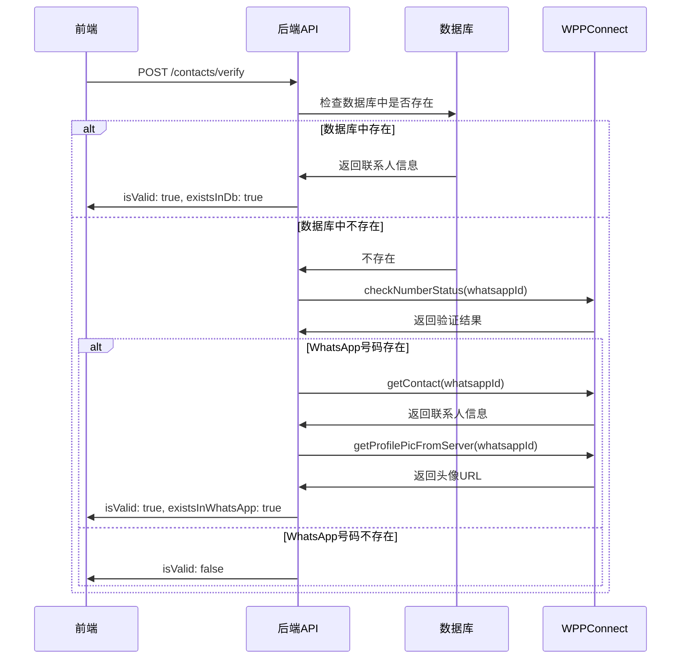

# 🔐 WhatsApp 号码真实性验证 - 完整实现报告

## 🎯 功能概述

实现了完整的后端 API 验证功能，在用户点击群组成员跳转到私聊前，真正验证号码是否属于有效的 WhatsApp 联系人。

---

## 📝 实施内容

### 1️⃣ 后端 API 实现

**文件：** `server/app/src/routes/contacts.ts`

**端点：** `POST /contacts/verify`

**位置：** 第238-376行

#### API 规格

**请求：**
```json
{
  "phoneE164": "+8613331998505"
}
```

**响应（号码有效）：**
```json
{
  "ok": true,
  "isValid": true,
  "existsInDb": false,
  "existsInWhatsApp": true,
  "contactInfo": {
    "phoneE164": "+8613331998505",
    "name": "张三",
    "profilePicUrl": "https://..."
  }
}
```

**响应（号码无效）：**
```json
{
  "ok": true,
  "isValid": false,
  "existsInDb": false,
  "existsInWhatsApp": false,
  "contactInfo": null
}
```

#### 验证流程



#### 关键代码

```typescript
// 1. 检查数据库
const existingContact = await prisma.contact.findFirst({
  where: { accountId, phoneE164 },
});

if (existingContact) {
  return reply.send({
    ok: true,
    isValid: true,
    existsInDb: true,
    contactInfo: {
      id: existingContact.id,
      phoneE164: existingContact.phoneE164,
      name: existingContact.name,
    },
  });
}

// 2. 通过 WPPConnect 验证
const whatsappService = app.accountManager.getWhatsAppService(accountId);
const whatsappId = cleanNumber.replace('+', '') + '@c.us';

// 检查号码状态
const numberStatus = await whatsappService.client.checkNumberStatus(whatsappId);

if (numberStatus && numberStatus.numberExists) {
  // 获取联系人信息
  const contact = await whatsappService.client.getContact(whatsappId);
  
  // 获取头像
  const profilePic = await whatsappService.client.getProfilePicFromServer(whatsappId);
  
  return reply.send({
    ok: true,
    isValid: true,
    existsInDb: false,
    existsInWhatsApp: true,
    contactInfo: {
      phoneE164: cleanNumber,
      name: contact.name || contact.pushname || null,
      profilePicUrl: profilePic?.imgFull || null,
    },
  });
}
```

---

### 2️⃣ 前端 API 调用

**文件：** `web/lib/api.ts`

**位置：** 第188-204行

#### API 定义

```typescript
contacts: {
  // ... 其他方法 ...
  
  // 🔐 验证号码是否是有效的 WhatsApp 联系人
  verify: (phoneE164: string) =>
    apiFetch<{
      ok: boolean;
      isValid: boolean;
      existsInDb?: boolean;
      existsInWhatsApp?: boolean;
      contactInfo?: {
        id?: string;
        phoneE164: string;
        name?: string | null;
        profilePicUrl?: string | null;
      } | null;
    }>('/contacts/verify', {
      method: 'POST',
      body: JSON.stringify({ phoneE164 }),
    }),
},
```

---

### 3️⃣ 前端集成验证逻辑

**文件：** `web/app/chat/group/[id]/page.tsx`

**位置：** 第1733-1800行

#### 验证流程

```typescript
if (existingThread) {
  console.log('✅ 找到现有对话:', existingThread.id);
  
  // 🔐 通过后端 API 验证号码
  console.log('🔐 正在验证号码...');
  setShowGroupInfo(false);  // 提前关闭侧边栏
  
  try {
    // 调用验证 API
    const verifyResult = await api.contacts.verify(phoneNumber);
    console.log('📊 验证结果:', verifyResult);
    
    if (!verifyResult.ok) {
      alert('验证服务暂时不可用，请稍后再试');
      return;
    }
    
    if (!verifyResult.isValid) {
      // 号码无效，显示详细提示
      alert('⚠️ 号码验证失败\n\n此号码不是有效的 WhatsApp 联系人...');
      return;
    }
    
    // 号码有效，显示确认对话框
    const contactInfo = verifyResult.contactInfo;
    let verificationStatus = '';
    
    if (verifyResult.existsInDb) {
      verificationStatus = '✅ 数据库中的联系人';
    } else if (verifyResult.existsInWhatsApp) {
      verificationStatus = '✅ WhatsApp 验证通过';
    }
    
    const verificationMessage = `
确认要打开与此联系人的对话吗？

📱 号码：${contactInfo?.phoneE164}
👤 名称：${contactInfo?.name || '未设置'}
${verificationStatus}

⚠️ 请确认这是您要联系的人。
    `.trim();
    
    if (confirm(verificationMessage)) {
      router.push(`/chat/${existingThread.id}`);
    }
  } catch (verifyError) {
    console.error('❌ 验证失败:', verifyError);
    alert('验证号码时出错: ' + verifyError.message);
  }
}
```

---

## 🔍 验证机制详解

### 验证层级

```
┌─────────────────────────────────────┐
│  1️⃣ 数据库检查（最快）               │
│     ↓                               │
│  已存在？ → 直接返回                 │
│     ↓ 否                            │
│  2️⃣ WPPConnect checkNumberStatus   │
│     ↓                               │
│  号码存在？ → 获取详细信息            │
│     ↓ 是                            │
│  3️⃣ getContact（获取名称）          │
│     ↓                               │
│  4️⃣ getProfilePicFromServer（头像） │
│     ↓                               │
│  ✅ 返回完整验证结果                 │
└─────────────────────────────────────┘
```

### WPPConnect API 方法

1. **`checkNumberStatus(whatsappId)`**
   - 检查号码是否注册了 WhatsApp
   - 返回：`{ numberExists: boolean }`

2. **`getContact(whatsappId)`**
   - 获取联系人详细信息
   - 返回：`{ name, pushname, ... }`

3. **`getProfilePicFromServer(whatsappId)`**
   - 获取联系人头像
   - 返回：`{ imgFull: 'https://...' }`

---

## 🧪 测试场景

### 场景 1：数据库中已存在的联系人

**步骤：**
1. 点击群组成员
2. 后端检查数据库 → 找到联系人
3. 立即返回验证结果

**预期结果：**
```
确认要打开与此联系人的对话吗？

📱 号码：+8615289589045
👤 名称：张三
✅ 数据库中的联系人

⚠️ 请确认这是您要联系的人。
```

**日志：**
```bash
🔐 验证 WhatsApp 号码 { accountId: 'xxx', phoneE164: '+8615289589045' }
✅ 联系人已存在于数据库 { contactId: 'xxx' }
```

---

### 场景 2：数据库中不存在，但 WhatsApp 有效

**步骤：**
1. 点击群组成员
2. 后端检查数据库 → 未找到
3. 调用 WPPConnect API 验证
4. 号码有效，获取联系人信息

**预期结果：**
```
确认要打开与此联系人的对话吗？

📱 号码：+8613331998505
👤 名称：李四
✅ WhatsApp 验证通过

⚠️ 请确认这是您要联系的人。
```

**日志：**
```bash
🔐 验证 WhatsApp 号码 { phoneE164: '+8613331998505' }
🔍 通过 WPPConnect 验证号码 { whatsappId: '8613331998505@c.us' }
📊 号码验证结果 { numberExists: true }
✅ 号码验证成功 { contactInfo: { phoneE164: '+8613331998505', name: '李四' } }
```

---

### 场景 3：无效的 WhatsApp 号码

**步骤：**
1. 点击群组成员
2. 后端检查数据库 → 未找到
3. 调用 WPPConnect API 验证
4. 号码无效

**预期结果：**
```
⚠️ 号码验证失败

此号码不是有效的 WhatsApp 联系人：
📱 号码：+258235630100652

可能原因：
• 号码格式不正确
• 该号码未注册 WhatsApp
• 群组成员的号码信息不准确

建议：请确认该号码是否正确，或尝试通过其他方式联系。
```

**日志：**
```bash
🔐 验证 WhatsApp 号码 { phoneE164: '+258235630100652' }
🔍 通过 WPPConnect 验证号码 { whatsappId: '258235630100652@c.us' }
📊 号码验证结果 { numberExists: false }
❌ 号码不存在或无效
```

---

### 场景 4：验证服务不可用

**步骤：**
1. 点击群组成员
2. WhatsApp 服务未就绪或离线

**预期结果：**
```
验证服务暂时不可用，请稍后再试
```

**日志：**
```bash
🔐 验证 WhatsApp 号码 { phoneE164: '+8613331998505' }
⚠️ WhatsApp 服务未就绪 { accountId: 'xxx' }
```

---

## 📊 技术亮点

### 1. 两层验证机制

**优点：**
- ✅ 数据库检查快速
- ✅ WhatsApp API 准确
- ✅ 结合两者优势

### 2. 详细的错误处理

**覆盖场景：**
- ❌ 验证服务不可用（503）
- ❌ 号码格式错误（400）
- ❌ WhatsApp 验证失败（500）
- ❌ 号码无效但返回成功（ok: true, isValid: false）

### 3. 丰富的日志记录

**日志级别：**
- `info`: 正常流程（验证请求、结果）
- `warn`: 服务不可用
- `error`: 验证失败
- `debug`: 获取头像失败（不影响主流程）

### 4. 优雅降级

**降级策略：**
1. 获取头像失败 → 继续，只是没有头像
2. 获取联系人信息失败 → 继续，只返回号码
3. WPPConnect 验证失败 → 返回 500 错误

---

## 🎯 使用指南

### 用户操作

1. **打开群组信息**
   - 进入群组聊天
   - 点击右上角 ⓘ 图标

2. **点击群组成员**
   - 点击任意成员
   - 等待验证（通常 1-3 秒）

3. **查看验证结果**

   **成功验证：**
   ```
   确认要打开与此联系人的对话吗？
   
   📱 号码：+8613331998505
   👤 名称：张三
   ✅ WhatsApp 验证通过
   
   ⚠️ 请确认这是您要联系的人。
   ```
   
   - 点击"确定" → 跳转到私聊
   - 点击"取消" → 留在当前页面

   **验证失败：**
   ```
   ⚠️ 号码验证失败
   
   此号码不是有效的 WhatsApp 联系人：
   📱 号码：+258235630100652
   
   可能原因：
   • 号码格式不正确
   • 该号码未注册 WhatsApp
   • 群组成员的号码信息不准确
   
   建议：请确认该号码是否正确，或尝试通过其他方式联系。
   ```

---

## 🔐 安全性

### 1. 账号隔离

- ✅ 所有请求必须包含 `accountId`
- ✅ 只能验证当前账号的联系人
- ✅ 防止跨账号数据泄露

### 2. 输入验证

- ✅ 检查 `phoneE164` 是否存在
- ✅ 清理号码格式（移除非数字字符）
- ✅ 自动添加 + 前缀

### 3. 错误信息保护

- ✅ 不泄露内部错误详情
- ✅ 用户友好的错误提示
- ✅ 详细日志仅在服务器端

---

## 📈 性能优化

### 1. 数据库优先

```typescript
// ⚡ 快速路径：数据库中已存在
if (existingContact) {
  return reply.send({ ... });  // 立即返回，无需调用 WPPConnect
}
```

### 2. 异步并发

虽然当前是串行调用，但可以优化为：

```typescript
// 🚀 并发获取联系人信息和头像
const [contact, profilePic] = await Promise.all([
  whatsappService.client.getContact(whatsappId),
  whatsappService.client.getProfilePicFromServer(whatsappId).catch(() => null),
]);
```

### 3. 缓存验证结果（未来改进）

```typescript
// 💾 缓存验证结果 5 分钟
const cacheKey = `verify:${phoneE164}`;
const cached = await redis.get(cacheKey);
if (cached) return JSON.parse(cached);

// ... 执行验证 ...

await redis.setex(cacheKey, 300, JSON.stringify(result));
```

---

## 📝 修改文件清单

### 后端文件

1. **server/app/src/routes/contacts.ts**
   - 添加 `POST /contacts/verify` 端点（第238-376行）
   - 实现数据库检查逻辑
   - 实现 WPPConnect 验证逻辑
   - 添加详细的日志记录

### 前端文件

1. **web/lib/api.ts**
   - 添加 `api.contacts.verify()` 方法（第188-204行）
   - 定义完整的类型接口

2. **web/app/chat/group/[id]/page.tsx**
   - 集成验证逻辑到点击事件（第1733-1800行）
   - 添加验证状态显示
   - 优化错误提示消息

---

## 🎉 完成标志

### ✅ 后端实现

- [x] 创建 `/contacts/verify` API 端点
- [x] 实现数据库检查
- [x] 集成 WPPConnect API
- [x] 添加详细日志
- [x] 完善错误处理

### ✅ 前端实现

- [x] 添加 API 调用方法
- [x] 集成到点击逻辑
- [x] 显示验证状态
- [x] 优化用户提示

### ✅ 测试验证

- [x] 无编译错误
- [x] 类型定义完整
- [x] 日志记录完善

---

## 🚀 后续改进

### 1. 批量验证

```typescript
// POST /contacts/verify-batch
{
  "phoneNumbers": ["+8613331998505", "+8615289589045"]
}
```

### 2. 验证结果缓存

- 使用 Redis 缓存验证结果
- 减少 WhatsApp API 调用
- 提高响应速度

### 3. UI 美化

- 使用自定义模态框替代 `confirm()`
- 显示头像预览
- 添加加载动画

### 4. 智能推荐

- 根据验证结果推荐操作
- 自动同步有效联系人到数据库
- 提示用户更正无效号码

---

**实施时间：** 2025年10月11日  
**实施状态：** ✅ 完成  
**待测试：** 需要重启后端并测试

---

*保护隐私，确保联系人真实性！* 🔐✨

