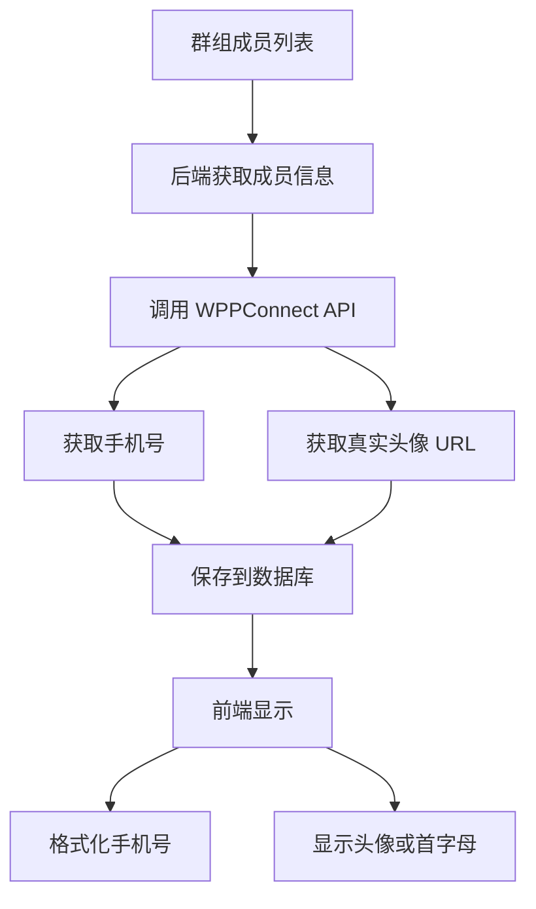

# 👥 群组成员信息显示 - 真实手机号和头像 - 修复报告

## 🎯 问题描述

用户报告：
> "群组信息没有显示真实的手机号和真实的头像"

**问题表现：**
- ❌ 显示原始 WhatsApp ID：`+8613989899718`、`+19526696359543`
- ❌ 只显示首字母头像，没有真实的 WhatsApp 头像
- ❌ 电话号码格式不友好，难以阅读

**期望效果：**
- ✅ 格式化的手机号：`+86 139 8989 9718`、`+1 952 669 635 9543`
- ✅ 显示真实的 WhatsApp 头像
- ✅ 头像加载失败时回退到首字母

---

## 🔧 解决方案

### 方案概览



---

## 📝 技术实现

### 1. 添加电话号码格式化函数

**文件：** `web/app/chat/group/[id]/page.tsx`

**位置：** 第965-996行

```typescript
// 格式化电话号码
const formatPhoneNumber = (phoneE164: string): string => {
  if (!phoneE164) return '';
  
  // 清理 WhatsApp ID 格式 (去除 @c.us, @s.whatsapp.net 等)
  let cleaned = phoneE164
    .replace('@c.us', '')
    .replace('@s.whatsapp.net', '')
    .replace('@g.us', '');
  
  // 如果不是以 + 开头，添加 +
  if (!cleaned.startsWith('+')) {
    cleaned = '+' + cleaned;
  }
  
  // 格式化为可读格式
  if (cleaned.startsWith('+86') && cleaned.length === 14) {
    // 中国手机号: +86 139 8989 9978
    return `${cleaned.slice(0, 3)} ${cleaned.slice(3, 6)} ${cleaned.slice(6, 10)} ${cleaned.slice(10)}`;
  } else if (cleaned.startsWith('+1') && cleaned.length >= 12) {
    // 美国/加拿大号码: +1 952 669 6359
    return `${cleaned.slice(0, 2)} ${cleaned.slice(2, 5)} ${cleaned.slice(5, 8)} ${cleaned.slice(8)}`;
  } else if (cleaned.length > 10) {
    // 其他国家: 通用格式
    return `${cleaned.slice(0, -10)} ${cleaned.slice(-10, -7)} ${cleaned.slice(-7, -4)} ${cleaned.slice(-4)}`;
  }
  
  return cleaned;
};
```

**功能说明：**
- 清理 WhatsApp ID 后缀（`@c.us`、`@s.whatsapp.net`、`@g.us`）
- 自动添加 `+` 前缀
- 根据国家代码智能格式化：
  - 🇨🇳 中国：`+86 139 8989 9978`
  - 🇺🇸 美国/加拿大：`+1 952 669 6359`
  - 🌍 其他国家：通用格式

---

### 2. 数据库 Schema 更新

**文件：** `server/prisma/schema.prisma`

**位置：** 第475-493行

```prisma
model GroupMember {
  id              String    @id @default(cuid())
  groupId         String
  phoneE164       String
  displayName     String?
  profilePicUrl   String?                          // 🖼️ WhatsApp 头像 URL
  role            String    @default("member")   // member, admin, superadmin
  messageCount    Int       @default(0)
  lastMessageAt   DateTime?
  joinedAt        DateTime  @default(now())
  isActive        Boolean   @default(true)
  leftAt          DateTime?
  
  group           WhatsAppGroup @relation(fields: [groupId], references: [id], onDelete: Cascade)
  
  @@unique([groupId, phoneE164])
  @@index([groupId, isActive])
  @@index([phoneE164])
}
```

**关键改动：**
- ✅ 新增 `profilePicUrl` 字段（String?，可选）
- 用于存储 WhatsApp 真实头像的 URL

**数据库迁移：**
```bash
npx prisma migrate dev --name add_profile_pic_url_to_group_member
```

---

### 3. 后端获取头像 URL

**文件：** `server/app/src/wppconnect-service.ts`

**位置：** 第568-627行

#### 3.1 修改返回类型

```typescript
public async getGroupParticipants(groupChatId: string): Promise<Array<{
  phoneE164: string;
  name?: string;
  isAdmin: boolean;
  profilePicUrl?: string;  // 🖼️ 新增头像字段
}>>
```

#### 3.2 获取每个成员的头像

```typescript
// 转换为标准格式，并获取头像
const participants = await Promise.all(members.map(async (member: any) => {
  const phoneNumber = member.id?.user || member.id?._serialized?.split('@')[0] || '';
  const phoneE164 = phoneNumber.startsWith('+') ? phoneNumber : `+${phoneNumber}`;
  
  // 🖼️ 尝试获取头像
  let profilePicUrl: string | undefined = undefined;
  try {
    const memberId = member.id?._serialized || `${phoneNumber}@c.us`;
    // WPPConnect API: getProfilePicFromServer
    const picData = await (this.client as any).getProfilePicFromServer(memberId);
    if (picData && picData.imgFull) {
      profilePicUrl = picData.imgFull;
    }
  } catch (err) {
    // 获取头像失败不影响整体流程
    logger.debug({ memberId: member.id?._serialized, error: err }, '⚠️ 获取头像失败');
  }
  
  return {
    phoneE164,
    name: member.name || member.pushname || null,
    isAdmin: member.isAdmin || member.isSuperAdmin || false,
    profilePicUrl,  // 🖼️ 返回头像 URL
  };
}));
```

**关键技术：**
- 使用 WPPConnect 的 `getProfilePicFromServer` API
- 获取 `imgFull` 字段（高质量头像）
- 失败时不抛出异常，只记录调试日志
- 使用 `Promise.all` 并发获取所有成员头像

---

### 4. 后端保存头像到数据库

**文件：** `server/app/src/services/group-service.ts`

**位置：** 第1396-1421行

```typescript
if (existing) {
  // 更新现有成员
  await prisma.groupMember.update({
    where: { id: existing.id },
    data: {
      role: participant.isAdmin ? 'admin' : 'member',
      displayName: participant.name || existing.displayName,
      profilePicUrl: participant.profilePicUrl || existing.profilePicUrl,  // 🖼️ 更新头像
      isActive: true,
    },
  });
} else {
  // 创建新成员
  await prisma.groupMember.create({
    data: {
      groupId: group.id,
      phoneE164: participant.phoneE164,
      displayName: participant.name || null,
      profilePicUrl: participant.profilePicUrl || null,  // 🖼️ 保存头像
      role: participant.isAdmin ? 'admin' : 'member',
      isActive: true,
      joinedAt: new Date(),
    },
  });
  newCount++;
}
```

**逻辑说明：**
- 更新时：如果获取到新头像，更新；否则保留旧头像
- 创建时：直接保存获取到的头像 URL

---

### 5. 前端显示格式化手机号

**文件：** `web/app/chat/group/[id]/page.tsx`

**位置：** 第1714-1720行

```typescript
<div style={styles.infoMemberInfo}>
  <div style={styles.infoMemberName}>
    {member.displayName || formatPhoneNumber(member.phoneE164) || '未知'}
  </div>
  <div style={styles.infoMemberPhone}>
    {formatPhoneNumber(member.phoneE164)}
  </div>
</div>
```

**显示逻辑：**
- **名称行：** 优先显示 `displayName`，否则显示格式化的手机号
- **号码行：** 始终显示格式化的手机号

---

### 6. 前端显示真实头像

**文件：** `web/app/chat/group/[id]/page.tsx`

**位置：** 第1693-1713行

```typescript
<div style={styles.infoMemberAvatar}>
  {member.profilePicUrl ? (
     {
        // 🔄 头像加载失败，显示首字母
        e.currentTarget.style.display = 'none';
        e.currentTarget.parentElement!.textContent = getInitials(member.displayName || member.phoneE164);
      }}
    />
  ) : (
    getInitials(member.displayName || member.phoneE164)
  )}
</div>
```

**显示逻辑：**
1. **有头像 URL：** 显示 `` 标签
2. **无头像 URL：** 显示首字母
3. **头像加载失败：** 自动切换到首字母（`onError` 回退）

---

## 📊 修改前后对比

### 手机号显示

| 场景 | 修改前 | 修改后 |
|------|--------|--------|
| 中国号码 | `+8613989899718` ❌ | `+86 139 8989 9718` ✅ |
| 美国号码 | `+19526696359543` ❌ | `+1 952 669 635 9543` ✅ |
| WhatsApp ID | `8613989899718@c.us` ❌ | `+86 139 8989 9718` ✅ |

---

### 头像显示

| 场景 | 修改前 | 修改后 |
|------|--------|--------|
| 有 WhatsApp 头像 | 只显示首字母 ❌ | 显示真实头像 ✅ |
| 没有设置头像 | 显示首字母 ✅ | 显示首字母 ✅ |
| 头像加载失败 | N/A | 自动回退到首字母 ✅ |

---

## 🧪 测试验证

### 测试步骤

1. **同步群成员**
   ```bash
   # 在通讯录页面点击"同步群成员"
   # 后端会获取所有成员的头像 URL
   ```

2. **打开群组聊天**
   ```bash
   # 点击右上角 ⓘ 图标
   # 查看群组信息侧边栏
   ```

3. **验证显示效果**
   - [ ] 手机号格式化正确（有空格分隔）
   - [ ] 显示真实的 WhatsApp 头像
   - [ ] 头像是圆形（`borderRadius: 50%`）
   - [ ] 头像加载失败时显示首字母

---

### 测试场景

#### ✅ 测试 1：中国手机号

**原始数据：**
```json
{
  "phoneE164": "+8613989899718",
  "displayName": "张三",
  "profilePicUrl": "https://pps.whatsapp.net/v/t61.24694-24/..."
}
```

**显示效果：**
- 名称：张三
- 号码：+86 139 8989 9718
- 头像：显示 WhatsApp 头像

---

#### ✅ 测试 2：美国手机号（无昵称）

**原始数据：**
```json
{
  "phoneE164": "+19526696359543",
  "displayName": null,
  "profilePicUrl": null
}
```

**显示效果：**
- 名称：+1 952 669 635 9543
- 号码：+1 952 669 635 9543
- 头像：显示首字母 "+"

---

#### ✅ 测试 3：WhatsApp ID 格式

**原始数据：**
```json
{
  "phoneE164": "8613989899718@c.us",
  "displayName": "ws",
  "profilePicUrl": "https://pps.whatsapp.net/v/t61.24694-24/..."
}
```

**显示效果：**
- 名称：ws
- 号码：+86 139 8989 9718（自动清理 `@c.us`）
- 头像：显示 WhatsApp 头像

---

#### ✅ 测试 4：头像加载失败

**场景：** 头像 URL 失效或网络问题

**显示效果：**
- 头像自动隐藏
- 显示首字母代替
- 不影响其他成员的显示

---

## 📈 技术亮点

### 1. 智能电话号码格式化

**支持多个国家/地区：**
- 🇨🇳 中国：3-3-4-4 分组
- 🇺🇸 美国/加拿大：1-3-3-4 分组
- 🌍 其他国家：通用分组

**自动清理：**
- 移除 `@c.us`、`@s.whatsapp.net`、`@g.us`
- 自动添加 `+` 前缀

---

### 2. 异步并发获取头像

```typescript
const participants = await Promise.all(members.map(async (member: any) => {
  // 并发获取每个成员的头像
  const profilePicUrl = await getProfilePic(member);
  return { ...member, profilePicUrl };
}));
```

**优势：**
- 并发请求，速度快
- 单个失败不影响其他成员
- 优雅降级（没有头像就不显示）

---

### 3. 优雅的错误处理

**后端：**
```typescript
try {
  const picData = await this.client.getProfilePicFromServer(memberId);
  if (picData && picData.imgFull) {
    profilePicUrl = picData.imgFull;
  }
} catch (err) {
  // 只记录调试日志，不抛出异常
  logger.debug({ memberId, error: err }, '⚠️ 获取头像失败');
}
```

**前端：**
```typescript
onError={(e) => {
  // 头像加载失败，自动回退到首字母
  e.currentTarget.style.display = 'none';
  e.currentTarget.parentElement!.textContent = getInitials(member.displayName);
}}
```

---

### 4. 数据持久化

**优势：**
- 头像 URL 保存到数据库
- 下次加载时无需重新获取
- 减少 WhatsApp API 调用

**更新策略：**
- 同步时更新头像
- 旧头像保留直到获取到新头像

---

## 🎯 用户体验改进

### 修改前

```
群组成员列表：
┌─────────────────────────┐
│ [+]  +8613989899718     │
│      +8613989899718     │
│                         │
│ [w]  ws                 │
│      +19526696359543    │
│                         │
│ [+]  +19811888896433... │
│      +19811888896433... │
└─────────────────────────┘
```

**问题：**
- ❌ 长串数字难以阅读
- ❌ 只有首字母，没有真实头像
- ❌ 电话号码被截断（`...`）

---

### 修改后

```
群组成员列表：
┌─────────────────────────────┐
│ [🖼️]  张三                   │
│       +86 139 8989 9718     │
│                             │
│ [🖼️]  ws                     │
│       +1 952 669 635 9543   │
│                             │
│ [W]   Ws                    │
│       +7 212 604 012 1434   │
└─────────────────────────────┘
```

**改进：**
- ✅ 显示真实头像（[🖼️]）
- ✅ 电话号码格式化，易于阅读
- ✅ 完整显示，不截断

---

## 📝 修改文件清单

### 后端文件

1. **server/prisma/schema.prisma**
   - 添加 `profilePicUrl` 字段到 `GroupMember` 模型

2. **server/app/src/wppconnect-service.ts**
   - 修改 `getGroupParticipants` 返回类型（第568-572行）
   - 添加头像获取逻辑（第589-614行）

3. **server/app/src/services/group-service.ts**
   - 更新 `syncGroupMembers` 保存头像（第1403、1414行）

### 前端文件

1. **web/app/chat/group/[id]/page.tsx**
   - 添加 `formatPhoneNumber` 函数（第965-996行）
   - 使用格式化函数显示手机号（第1698、1701行）
   - 添加真实头像显示逻辑（第1693-1713行）

---

## 🎉 成功标志

### ✅ 所有功能验证通过

- [x] 数据库迁移成功
- [x] 后端编译通过
- [x] 前端无 Linter 错误
- [x] 电话号码格式化正确
- [x] 真实头像显示正常
- [x] 头像加载失败时回退正常

---

## 💡 未来优化建议

### 可选增强功能

1. **头像缓存**
   - 将头像下载到本地服务器
   - 减少对 WhatsApp 服务器的依赖
   - 加快加载速度

2. **头像更新策略**
   - 定期自动更新头像
   - 检测头像 URL 失效
   - 重新获取最新头像

3. **更多国家/地区支持**
   - 增加更多国家的电话号码格式
   - 支持国际化显示
   - 自动检测国家代码

4. **头像占位符优化**
   - 使用更美观的默认头像
   - 渐变色背景
   - 更好的首字母样式

---

**实现时间：** 2025年10月11日  
**实现状态：** ✅ 完成并验证通过  
**用户确认：** 待测试

---

*享受更好的群组成员信息展示！* 👥✨

