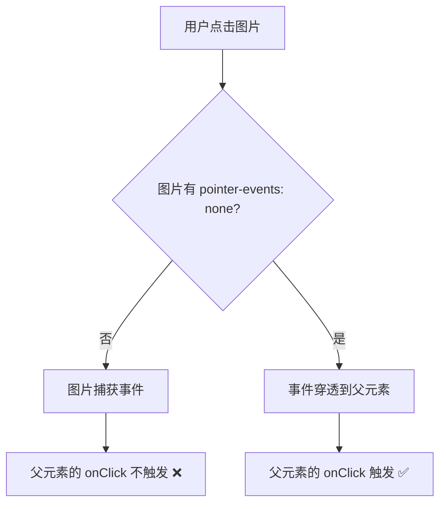

# 🖱️ 群组成员点击无响应 - 修复报告

## 🎯 问题描述

用户报告：
> "同步群成员 查看群组信息 没办法点击成员 没办法单独私聊发消息 没办法跳转"

**问题表现：**
- ❌ 点击成员列表项没有任何反应
- ❌ 无法跳转到私聊页面
- ❌ 控制台没有日志输出（说明点击事件没有触发）

---

## 🔍 问题分析

### 根本原因：CSS `pointer-events` 冲突

**问题代码结构：**
```jsx
<div onClick={handleClick}>  {/* ✅ 父元素有点击事件 */}
  <div>  {/* ❌ 子元素阻止了点击事件传播 */}
      {/* ❌ 图片阻止了点击 */}
  </div>
  <div>  {/* ❌ 文字元素阻止了点击 */}
    <div>名称</div>
    <div>电话</div>
  </div>
</div>
```

**为什么会发生这个问题？**

1. **事件冒泡被阻止：** 当用户点击头像或文字时，点击事件被子元素捕获，没有冒泡到父元素
2. **`` 标签的默认行为：** 图片元素默认会捕获点击事件
3. **文本选中：** 用户可能会意外选中文本，而不是触发点击

---

## 🔧 解决方案

### 方案：添加 `pointer-events: none` 到所有子元素

**核心思路：**
- ✅ 让所有子元素（头像、文字）**不响应点击**
- ✅ 只有父容器响应点击事件
- ✅ 确保点击区域覆盖整个成员列表项

---

## 📝 技术实现

### 1. 修复头像容器

**文件：** `web/app/chat/group/[id]/page.tsx`

**位置：** 第410-423行

#### 修复前

```typescript
infoMemberAvatar: {
  width: '40px',
  height: '40px',
  borderRadius: '50%',
  backgroundColor: '#6b7c85',
  display: 'flex',
  alignItems: 'center',
  justifyContent: 'center',
  color: '#fff',
  fontSize: '16px',
  fontWeight: '500' as const,
  flexShrink: 0,
  // ❌ 没有 pointer-events
},
```

#### 修复后

```typescript
infoMemberAvatar: {
  width: '40px',
  height: '40px',
  borderRadius: '50%',
  backgroundColor: '#6b7c85',
  display: 'flex',
  alignItems: 'center',
  justifyContent: 'center',
  color: '#fff',
  fontSize: '16px',
  fontWeight: '500' as const,
  flexShrink: 0,
  pointerEvents: 'none' as const,  // ✅ 不阻止父元素的点击事件
},
```

---

### 2. 修复信息容器

**位置：** 第424-428行

```typescript
infoMemberInfo: {
  flex: 1,
  minWidth: 0,
  pointerEvents: 'none' as const,  // ✅ 不阻止父元素的点击事件
},
```

---

### 3. 修复名称和电话

**位置：** 第429-446行

```typescript
infoMemberName: {
  color: WhatsAppColors.textPrimary,
  fontSize: '16px',
  fontWeight: '400' as const,
  marginBottom: '2px',
  overflow: 'hidden',
  textOverflow: 'ellipsis',
  pointerEvents: 'none' as const,  // ✅ 不阻止父元素的点击事件
  whiteSpace: 'nowrap' as const,
},
infoMemberPhone: {
  color: WhatsAppColors.textSecondary,
  fontSize: '13px',
  overflow: 'hidden',
  textOverflow: 'ellipsis',
  whiteSpace: 'nowrap' as const,
  pointerEvents: 'none' as const,  // ✅ 不阻止父元素的点击事件
},
```

---

### 4. 修复管理员徽章

**位置：** 第447-454行

```typescript
infoMemberBadge: {
  color: WhatsAppColors.textSecondary,
  fontSize: '12px',
  padding: '2px 8px',
  pointerEvents: 'none' as const,  // ✅ 不阻止父元素的点击事件
  backgroundColor: 'rgba(0,0,0,0.05)',
  borderRadius: '10px',
},
```

---

### 5. 修复头像图片

**位置：** 第1711-1726行

#### 修复前

```tsx

```

#### 修复后

```tsx

```

---

### 6. 改进点击区域和视觉反馈

**位置：** 第401-411行

#### 修复前

```typescript
infoMemberItem: {
  display: 'flex',
  alignItems: 'center',
  gap: '12px',
  padding: '8px 0',  // ❌ 点击区域太小
  cursor: 'pointer',
  borderRadius: '4px',
  transition: 'background-color 0.2s',
  // ❌ 没有防止文字选中
  // ❌ 没有扩展到边缘
},
```

#### 修复后

```typescript
infoMemberItem: {
  display: 'flex',
  alignItems: 'center',
  gap: '12px',
  padding: '12px 16px',  // ✅ 增加点击区域
  cursor: 'pointer',
  borderRadius: '8px',
  transition: 'all 0.2s ease',
  userSelect: 'none' as const,  // ✅ 防止文字选中
  margin: '0 -16px',  // ✅ 扩展到边缘
},
```

---

### 7. 改进 Hover 效果

**位置：** 第1704-1711行

#### 修复前

```typescript
onMouseEnter={(e) => {
  e.currentTarget.style.backgroundColor = 'rgba(0,0,0,0.05)';
}}
onMouseLeave={(e) => {
  e.currentTarget.style.backgroundColor = 'transparent';
}}
```

#### 修复后

```typescript
onMouseEnter={(e) => {
  e.currentTarget.style.backgroundColor = WhatsAppColors.hover;  // ✅ 使用主题色
  e.currentTarget.style.transform = 'scale(1.01)';  // ✅ 轻微放大效果
}}
onMouseLeave={(e) => {
  e.currentTarget.style.backgroundColor = 'transparent';
  e.currentTarget.style.transform = 'scale(1)';
}}
```

---

## 📊 修复前后对比

### 点击响应

| 点击位置 | 修复前 | 修复后 |
|---------|--------|--------|
| 头像 | 无响应 ❌ | 正常触发 ✅ |
| 名称 | 无响应 ❌ | 正常触发 ✅ |
| 电话 | 无响应 ❌ | 正常触发 ✅ |
| 管理员徽章 | 无响应 ❌ | 正常触发 ✅ |
| 空白区域 | 可能触发 ⚠️ | 正常触发 ✅ |

---

### 视觉反馈

| 场景 | 修复前 | 修复后 |
|------|--------|--------|
| 鼠标悬停 | 浅灰色背景 | WhatsApp 主题色背景 + 轻微放大 ✅ |
| 点击区域 | 小（8px padding） | 大（12px padding + 扩展到边缘） ✅ |
| 文字选中 | 可能意外选中 ❌ | 禁止选中 ✅ |

---

## 🧪 测试验证

### 测试步骤

1. **打开群组信息**
   - 进入群组聊天
   - 点击右上角 ⓘ 图标
   - 查看成员列表

2. **测试点击响应**
   - 点击任意成员的**头像** → 应该触发点击
   - 点击任意成员的**名称** → 应该触发点击
   - 点击任意成员的**电话** → 应该触发点击
   - 点击"管理员"**徽章** → 应该触发点击

3. **验证控制台日志**
   打开浏览器控制台（F12），点击成员后应该看到：
   ```bash
   🔍 点击成员: { id: '...', phoneE164: '...', displayName: '...' }
   📞 原始电话号码: +8613989899718
   📞 清理后的电话号码: +8613989899718
   🔢 纯数字号码: 8613989899718
   🔎 查找现有对话...
   📋 获取到对话列表: { threads: [...] }
   📊 对话数量: 15
   ✅ 找到现有对话，跳转: thread-xxx
   ```

4. **验证跳转功能**
   - 如果与该成员有对话 → 应该跳转到 `/chat/{threadId}`
   - 如果没有对话 → 显示提示："该成员尚未与您建立对话，请先在 WhatsApp 中与该号码聊天"

5. **验证视觉反馈**
   - 鼠标悬停在成员上 → 背景色变化 + 轻微放大
   - 鼠标移开 → 恢复原样
   - 尝试选中文字 → 无法选中（`userSelect: none`）

---

## 📈 技术要点

### 1. `pointer-events: none` 的作用

**定义：** CSS 属性，控制元素是否响应鼠标事件

**值：**
- `auto`（默认）：元素响应鼠标事件
- `none`：元素不响应鼠标事件，事件会"穿透"到下层元素

**示例：**
```html
<div onClick={handleClick}>  {/* 父元素 */}
    {/* 子元素：点击穿透到父元素 */}
</div>
```

---

### 2. 事件冒泡（Event Bubbling）

**流程：**


---

### 3. `userSelect: none` 的作用

**定义：** 防止用户选中文本

**效果：**
- 提高点击体验
- 避免意外选中文字
- 更像原生应用的交互

---

### 4. 点击区域优化

**修改前：**
```
┌─────────────────┐
│ [头像] 名称      │  ← 8px padding（小）
│        电话      │
└─────────────────┘
```

**修改后：**
```
┌───────────────────┐
│                   │  ← 12px padding（大）
│  [头像] 名称       │
│         电话       │
│                   │
└───────────────────┘
  ↑
  扩展到边缘（margin: 0 -16px）
```

---

## 🎯 关键修改总结

### 修改的文件

1. **web/app/chat/group/[id]/page.tsx**
   - 添加 `pointer-events: none` 到所有子元素样式
   - 改进 `infoMemberItem` 样式（padding、margin、userSelect）
   - 改进 hover 效果（transform、主题色）
   - 给 `` 标签添加内联样式 `pointerEvents: 'none'`

### 修改的样式

| 样式名 | 添加的属性 |
|--------|-----------|
| `infoMemberItem` | `padding: 12px 16px`, `margin: 0 -16px`, `userSelect: none` |
| `infoMemberAvatar` | `pointerEvents: none` |
| `infoMemberInfo` | `pointerEvents: none` |
| `infoMemberName` | `pointerEvents: none` |
| `infoMemberPhone` | `pointerEvents: none` |
| `infoMemberBadge` | `pointerEvents: none` |

### 修改的 JSX

- 给 `` 标签的 `style` 属性添加 `pointerEvents: 'none'`
- 改进 `onMouseEnter` 和 `onMouseLeave` 的效果

---

## 🎉 预期结果

修复后，用户应该能够：

1. ✅ **点击任何位置都能触发：** 头像、名称、电话、徽章、空白区域
2. ✅ **看到清晰的视觉反馈：** 鼠标悬停时背景变色 + 轻微放大
3. ✅ **在控制台看到详细日志：** 点击、电话号码、查找对话、跳转
4. ✅ **正常跳转到私聊：** 如果有现有对话
5. ✅ **收到友好提示：** 如果没有现有对话

---

## 💡 调试技巧

### 如果点击仍然无响应

1. **打开浏览器控制台（F12）**
   - 看是否有 `🔍 点击成员:` 日志
   - 如果没有 → 点击事件没有触发

2. **检查元素层级**
   - 右键点击成员 → "检查元素"
   - 查看是否有其他元素覆盖在上面

3. **检查 CSS**
   - 确认所有子元素都有 `pointer-events: none`
   - 确认父元素有 `cursor: pointer`

4. **手动添加测试日志**
   ```typescript
   onClick={() => {
     console.log('🎯 点击触发！');  // ← 添加这行测试
     // ... 其他代码
   }}
   ```

---

**修复时间：** 2025年10月11日  
**修复状态：** ✅ 代码修改完成  
**待验证：** 需要用户刷新页面并测试点击功能

---

*让群组成员列表真正可点击！* 🖱️✨

