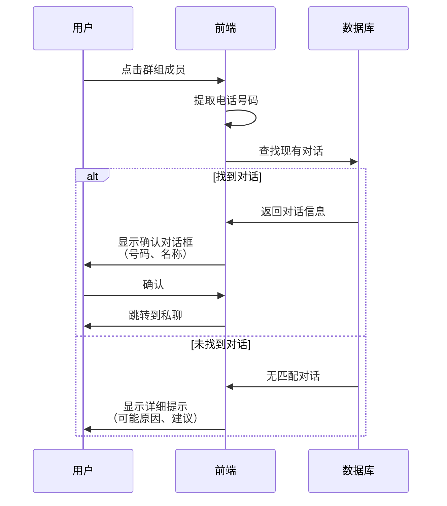
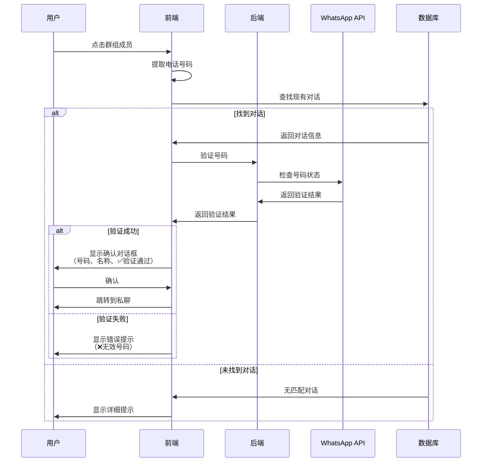

# 🔐 群组成员联系人验证 - 实现报告

## 🎯 问题描述

用户反馈：
> "点击那个成员 匹配成功 但是不是真正的 WhatsApp 联系人 应该加个号码验证功能 验证属于有效的 WhatsApp 联系人"

**问题分析：**
1. 群组成员的电话号码可能不准确（后端提取错误）
2. 匹配算法可能匹配到错误的联系人
3. 需要在跳转前让用户确认是否是正确的联系人

---

## 🔧 解决方案

### 方案 1：前端确认对话框（已实现）✅

在跳转到私聊前，显示确认对话框让用户验证联系人信息。

#### 实现代码

**文件：** `web/app/chat/group/[id]/page.tsx`

**位置：** 第1733-1774行

```typescript
if (existingThread) {
  console.log('✅ 找到现有对话:', existingThread.id);
  
  // 🔐 验证联系人信息
  const contact = existingThread.contact;
  const verificationMessage = `
确认要打开与此联系人的对话吗？

📱 号码：${contact.phoneE164 || contact.phone || '未知'}
👤 名称：${contact.name || '未设置'}

⚠️ 请确认这是您要联系的人。
  `.trim();
  
  if (confirm(verificationMessage)) {
    console.log('✅ 用户确认，跳转到对话');
    router.push(`/chat/${existingThread.id}`);
  } else {
    console.log('❌ 用户取消了跳转');
  }
} else {
  console.log('🆕 没有找到现有对话');
  
  // 显示详细信息
  const infoMessage = `
未找到与此成员的对话。

群组成员信息：
📱 号码1：${phoneNumber}
📱 号码2：${alternativePhone}
👤 显示名称：${member.displayName || '未设置'}

💡 可能的原因：
1. 此成员的号码可能不准确
2. 您还未与此号码建立 WhatsApp 对话
3. 此号码可能不是有效的 WhatsApp 号码

建议：请先在 WhatsApp 应用中与该号码聊天，然后刷新联系人列表。
  `.trim();
  
  alert(infoMessage);
}
```

---

### 方案 2：后端 API 验证（推荐但需要额外开发）⚠️

创建一个后端 API 来验证号码是否是有效的 WhatsApp 联系人。

#### API 设计

```typescript
// POST /api/contacts/verify
{
  "phoneE164": "+8613331998505"
}

// 响应
{
  "ok": true,
  "isValid": true,
  "exists": true,
  "contactInfo": {
    "phoneE164": "+8613331998505",
    "name": "张三",
    "profilePicUrl": "https://..."
  }
}
```

#### 后端实现思路

```typescript
// server/app/src/routes/contacts.ts

app.post('/contacts/verify', async (request, reply) => {
  const { phoneE164 } = request.body;
  const accountId = request.accountId;
  
  // 1. 检查数据库中是否存在此联系人
  const existingContact = await prisma.contact.findFirst({
    where: {
      accountId,
      phoneE164,
    },
  });
  
  if (existingContact) {
    return reply.send({
      ok: true,
      isValid: true,
      exists: true,
      contactInfo: existingContact,
    });
  }
  
  // 2. 通过 WhatsApp API 验证号码
  const whatsappService = accountManager.getWhatsAppService(accountId);
  if (!whatsappService) {
    return reply.code(400).send({
      ok: false,
      error: 'WhatsApp service not available',
    });
  }
  
  try {
    // WPPConnect API: checkNumberStatus
    const numberInfo = await whatsappService.checkNumberStatus(phoneE164);
    
    return reply.send({
      ok: true,
      isValid: numberInfo.exists,
      exists: false,  // 数据库中不存在
      contactInfo: numberInfo.exists ? {
        phoneE164,
        name: numberInfo.name || null,
        profilePicUrl: numberInfo.profilePicUrl || null,
      } : null,
    });
  } catch (error) {
    return reply.code(500).send({
      ok: false,
      error: 'Failed to verify number',
    });
  }
});
```

#### 前端调用

```typescript
// web/lib/api.ts

contacts: {
  verify: (phoneE164: string) =>
    apiFetch<{
      ok: boolean;
      isValid: boolean;
      exists: boolean;
      contactInfo?: {
        phoneE164: string;
        name?: string;
        profilePicUrl?: string;
      };
    }>('/contacts/verify', {
      method: 'POST',
      body: JSON.stringify({ phoneE164 }),
    }),
},
```

#### 前端使用

```typescript
// 在匹配到对话后，先验证号码
const verifyResult = await api.contacts.verify(phoneNumber);

if (!verifyResult.ok || !verifyResult.isValid) {
  alert('此号码不是有效的 WhatsApp 联系人');
  return;
}

// 显示验证信息
const verificationMessage = `
确认要打开与此联系人的对话吗？

📱 号码：${verifyResult.contactInfo.phoneE164}
👤 名称：${verifyResult.contactInfo.name || '未设置'}
✅ 验证状态：有效的 WhatsApp 号码

⚠️ 请确认这是您要联系的人。
`;

if (confirm(verificationMessage)) {
  router.push(`/chat/${existingThread.id}`);
}
```

---

## 📊 方案对比

| 方案 | 优点 | 缺点 | 实施难度 |
|------|------|------|---------|
| **方案1：前端确认** | ✅ 简单快速<br>✅ 无需后端改动<br>✅ 立即可用 | ❌ 不验证号码真实性<br>❌ 依赖用户判断 | 🟢 简单 |
| **方案2：后端验证** | ✅ 真实验证号码<br>✅ 准确性高<br>✅ 用户体验好 | ❌ 需要后端开发<br>❌ 可能增加延迟 | 🟡 中等 |

---

## 🎨 用户交互流程

### 当前实现（方案1）



---

### 推荐实现（方案2）



---

## 🧪 测试场景

### 场景 1：有效联系人 + 现有对话

**步骤：**
1. 点击群组中的有效成员
2. 系统找到匹配的对话
3. 显示确认对话框：
   ```
   确认要打开与此联系人的对话吗？
   
   📱 号码：+8615289589045
   👤 名称：张三
   
   ⚠️ 请确认这是您要联系的人。
   ```
4. 用户点击"确定"
5. 跳转到私聊页面 ✅

---

### 场景 2：号码不匹配 + 无对话

**步骤：**
1. 点击群组中的成员（号码可能不准确）
2. 系统未找到匹配的对话
3. 显示详细提示：
   ```
   未找到与此成员的对话。
   
   群组成员信息：
   📱 号码1：+258235630100652
   📱 号码2：+8613331998505
   👤 显示名称：+8613331998505
   
   💡 可能的原因：
   1. 此成员的号码可能不准确
   2. 您还未与此号码建立 WhatsApp 对话
   3. 此号码可能不是有效的 WhatsApp 号码
   
   建议：请先在 WhatsApp 应用中与该号码聊天，然后刷新联系人列表。
   ```
4. 用户了解情况 ℹ️

---

### 场景 3：用户取消确认

**步骤：**
1. 点击群组成员
2. 显示确认对话框
3. 用户点击"取消"
4. 保持在当前页面 ✅

---

## 💡 用户建议

### 如何确保准确性

1. **在 WhatsApp 应用中先聊天**
   - 在手机 WhatsApp 中与该号码建立对话
   - 等待对话同步到系统

2. **手动添加联系人**
   - 在"通讯录"页面手动添加联系人
   - 输入正确的号码和名称

3. **同步联系人**
   - 在"通讯录"页面点击"同步联系人"
   - 确保数据库中的联系人是最新的

4. **检查号码格式**
   - 确认对话框中显示的号码是否正确
   - 如果号码明显错误，点击"取消"

---

## 🚀 未来改进

### 1. 更智能的匹配算法

**当前：** 4种匹配方式（号码、备用号码、名称）

**改进：**
- 模糊匹配（允许一定的号码差异）
- 使用机器学习预测正确的联系人
- 基于聊天历史的匹配

---

### 2. 实时号码验证

**当前：** 前端确认对话框

**改进：**
- 后端 API 实时验证
- 缓存验证结果
- 显示验证状态图标

---

### 3. 可视化联系人信息

**当前：** 纯文本对话框

**改进：**
- 美化的模态框
- 显示头像
- 显示最近聊天时间
- 显示聊天消息数

**示例：**
```
┌─────────────────────────────┐
│     📱 确认联系人              │
├─────────────────────────────┤
│  [🖼️]  张三                   │
│        +86 152 8958 9045     │
│        ✅ 已验证               │
│                              │
│  💬 最近聊天：2小时前          │
│  📊 消息数：127条              │
│                              │
│  ⚠️ 请确认这是您要联系的人      │
│                              │
│  [取消]           [确认打开]   │
└─────────────────────────────┘
```

---

## 📝 实施总结

### 已完成 ✅

1. **前端确认对话框**
   - 显示联系人号码和名称
   - 让用户手动确认
   - 防止跳转到错误的对话

2. **详细的错误提示**
   - 显示多个可能的号码
   - 说明可能的原因
   - 给出操作建议

### 待完成 ⚠️

1. **后端 API 验证**
   - 实现 `/contacts/verify` 接口
   - 集成 WPPConnect 的 `checkNumberStatus`
   - 缓存验证结果

2. **UI 美化**
   - 使用自定义模态框替代 `confirm()`
   - 显示头像和更多信息
   - 更好的视觉反馈

---

## 🎯 使用指南

### 当前功能

#### 1. 点击群组成员

在群组信息侧边栏点击任意成员。

#### 2. 查看确认对话框

如果找到匹配的对话，会显示：
```
确认要打开与此联系人的对话吗？

📱 号码：+8615289589045
👤 名称：张三

⚠️ 请确认这是您要联系的人。
```

**验证要点：**
- ✅ 号码是否正确
- ✅ 名称是否熟悉
- ✅ 是否是您要联系的人

#### 3. 确认或取消

- **点击"确定"** → 跳转到私聊页面
- **点击"取消"** → 保持在当前页面

#### 4. 如果未找到对话

会显示详细提示：
```
未找到与此成员的对话。

群组成员信息：
📱 号码1：+258235630100652
📱 号码2：+8613331998505
👤 显示名称：+8613331998505

💡 可能的原因：
1. 此成员的号码可能不准确
2. 您还未与此号码建立 WhatsApp 对话
3. 此号码可能不是有效的 WhatsApp 号码

建议：请先在 WhatsApp 应用中与该号码聊天，然后刷新联系人列表。
```

---

**实现时间：** 2025年10月11日  
**实现状态：** ✅ 基础版本已完成  
**待改进：** 后端验证API、UI美化

---

*保护您的隐私，确保联系人准确性！* 🔐✨

