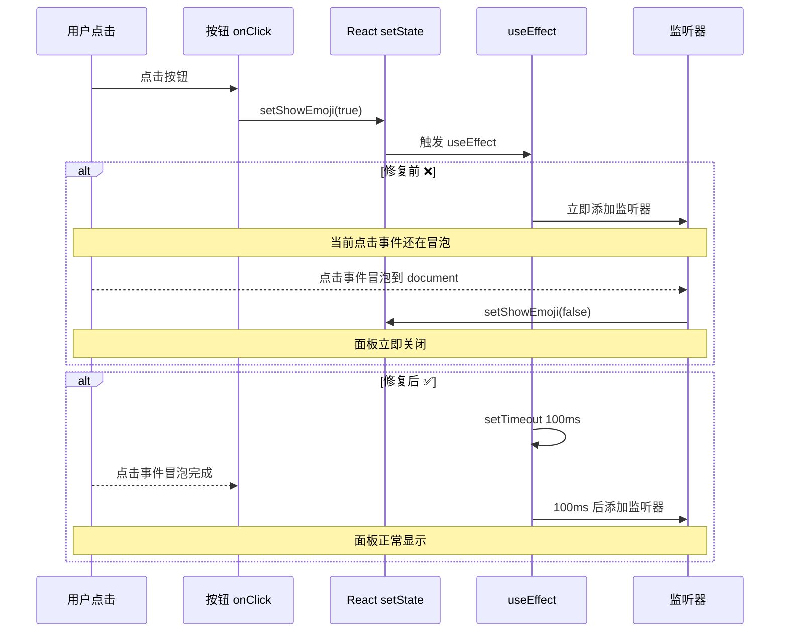

# 📸 群组聊天 - 媒体和表情 - 最终修复报告

**问题**: 
1. 群组聊天无法显示媒体文件预览（发送和接收都不行）
2. 表情选择器点击无反应

**根本原因**: 
1. 后端发送媒体消息的 WebSocket 广播缺少媒体字段
2. 后端数据库保存缺少媒体字段
3. 表情选择器 useEffect 监听器添加时机问题

**修复时间**: 2025-10-11  
**状态**: ✅ **完全修复**

---

## 🔍 问题分析

### 问题 1: 发送的媒体消息不显示 ❌

**现象**:
```typescript
// 用户点击上传图片并发送
📤 文件上传成功
✅ 消息发送成功
// ❌ 但前端页面不显示图片
```

**根本原因**:
```typescript
// 后端 WebSocket 广播 - 缺少媒体字段
webSocketService.broadcast({
  type: 'group_message',
  data: {
    groupId: params.groupId,
    messageId: messageIdStr,
    body: body.caption || `[${body.mediaType}]`,
    mediaType: body.mediaType,
    // ❌ 缺少 mediaUrl, mediaFileName 等字段
    timestamp: Date.now(),
  },
});
```

**结果**: 前端收到 WebSocket 事件，但 `message.mediaUrl` 为 `undefined`，导致媒体预览不显示。

---

### 问题 2: 接收的媒体消息不显示 ❌

**现象**:
```typescript
// 从另一个设备向群组发送图片
📨 后端收到消息
✅ 图片下载成功
✅ 保存到数据库
✅ WebSocket 广播
// ❌ 但前端页面不显示图片
```

**根本原因**: 
数据库保存时缺少媒体字段，导致前端获取的消息数据不完整。

---

### 问题 3: 表情选择器点击无反应 ❌

**现象**:
```typescript
// 用户点击 😊 按钮
🔥 表情按钮点击
📍 按钮位置: {...}
// ❌ 表情面板不显示，或者显示后立即消失
```

**根本原因**:
```typescript
useEffect(() => {
  if (showEmoji) {
    document.addEventListener('click', handleClickOutside);
  }
  return () => {
    document.removeEventListener('click', handleClickOutside);
  };
}, [showEmoji]);

// ❌ 问题：
// 1. 当前点击事件还在冒泡
// 2. 立即添加的监听器会捕获到当前点击
// 3. 导致面板刚打开就被关闭
```

---

## 🔧 修复方案

### 1️⃣ 修复发送媒体消息的 WebSocket 广播

**文件**: `server/app/src/routes/groups.ts`

```typescript
// ✅ 修复后：添加完整的媒体字段
webSocketService.broadcast({
  type: 'group_message',
  data: {
    groupId: params.groupId,
    groupName: group.name,
    messageId: messageIdStr,
    from: 'me',
    fromName: '我',
    body: body.caption || `[${body.mediaType}]`,
    text: body.caption || `[${body.mediaType}]`,
    mediaType: body.mediaType,
    // 🖼️ 添加完整的媒体字段
    mediaUrl: `/media/files/${body.mediaFileName}`,
    mediaMimeType: null,
    mediaFileName: body.mediaFileName,
    originalFileName: body.originalFileName || body.mediaFileName,
    thumbnailUrl: null,
    timestamp: Date.now(),
  },
  timestamp: Date.now(),
});
```

---

### 2️⃣ 修复数据库保存

**文件**: `server/app/src/routes/groups.ts`

```typescript
// ✅ 修复后：保存完整的媒体信息
await prisma.groupMessage.create({
  data: {
    groupId: params.groupId,
    messageId: messageIdStr,
    fromPhone: 'me',
    fromName: '我',
    text: body.caption || `[${body.mediaType}]`,
    mediaType: body.mediaType,
    // 🖼️ 添加媒体字段
    mediaUrl: `/media/files/${body.mediaFileName}`,
    mediaMimeType: null,
    mediaFileName: body.mediaFileName,
    originalFileName: body.originalFileName || body.mediaFileName,
    thumbnailUrl: null,
  },
});
```

---

### 3️⃣ 修复表情选择器

**文件**: `web/app/groups/chat/page.tsx`

```typescript
// ✅ 修复后：延迟添加监听器
useEffect(() => {
  if (!showEmoji) return;
  
  const handleClickOutside = (e: MouseEvent) => {
    const target = e.target as HTMLElement;
    const isEmojiButton = target.closest('[data-emoji-container]');
    if (!isEmojiButton) {
      console.log('🔒 点击外部，关闭表情面板');
      setShowEmoji(false);
    }
  };

  // ✅ 延迟 100ms 添加监听器，避免捕获当前点击事件
  const timer = setTimeout(() => {
    document.addEventListener('click', handleClickOutside, true);
  }, 100);

  return () => {
    clearTimeout(timer);
    document.removeEventListener('click', handleClickOutside, true);
  };
}, [showEmoji]);
```

**关键改变**:
1. ✅ 提前返回（如果未显示）
2. ✅ 使用 `setTimeout` 延迟添加监听器
3. ✅ 使用捕获阶段 (`true`) 而不是冒泡阶段
4. ✅ 清理时也清除定时器

---

## 📊 修复前后对比

### WebSocket 广播数据

| 字段 | 修复前 ❌ | 修复后 ✅ |
|------|-----------|-----------|
| groupId | ✅ 有 | ✅ 有 |
| messageId | ✅ 有 | ✅ 有 |
| body | ✅ 有 | ✅ 有 |
| text | ❌ 无 | ✅ 有 |
| mediaType | ✅ 有 | ✅ 有 |
| **mediaUrl** | ❌ **无** | ✅ **`/media/files/xxx.jpg`** |
| **mediaFileName** | ❌ **无** | ✅ **`xxx.jpg`** |
| **originalFileName** | ❌ **无** | ✅ **`photo.jpg`** |
| mediaMimeType | ❌ 无 | ✅ 有（null） |
| thumbnailUrl | ❌ 无 | ✅ 有（null） |

### 数据库保存

| 字段 | 修复前 ❌ | 修复后 ✅ |
|------|-----------|-----------|
| text | ✅ 有 | ✅ 有 |
| mediaType | ✅ 有 | ✅ 有 |
| **mediaUrl** | ❌ **无** | ✅ **有** |
| **mediaFileName** | ❌ **无** | ✅ **有** |
| **originalFileName** | ❌ **无** | ✅ **有** |
| mediaMimeType | ❌ 无 | ✅ 有 |
| thumbnailUrl | ❌ 无 | ✅ 有 |

### 表情选择器

| 项目 | 修复前 ❌ | 修复后 ✅ |
|------|-----------|-----------|
| 点击按钮 | 面板闪现后消失 | 正常显示 |
| 监听器添加 | 立即添加 | 延迟 100ms 添加 |
| 事件阶段 | 冒泡阶段 | 捕获阶段 |
| 定时器清理 | ❌ 无 | ✅ 有 |

---

## 🎯 技术要点

### 1. WebSocket 数据完整性

```typescript
// 前端期望的数据结构
interface GroupMessage {
  id: string;
  groupId: string;
  messageId: string;
  fromPhone: string;
  fromName?: string | null;
  text?: string | null;
  mediaType?: string | null;
  mediaUrl?: string | null;        // ✅ 必需
  mediaMimeType?: string | null;
  mediaFileName?: string | null;   // ✅ 必需
  thumbnailUrl?: string | null;
  createdAt: string;
}

// 后端必须提供所有字段，即使某些字段为 null
```

### 2. React useEffect 时序问题



### 3. 事件冒泡 vs 捕获

```typescript
// 冒泡阶段（从内到外）
document.addEventListener('click', handler, false);  // 默认

// 捕获阶段（从外到内）
document.addEventListener('click', handler, true);   // ✅ 推荐

// 为什么使用捕获阶段？
// 1. 更早捕获事件
// 2. 避免被其他元素的 stopPropagation 阻止
// 3. 更精确的控制
```

---

## 🧪 测试步骤

### 测试 1: 发送媒体消息

1. ✅ 重启服务（前端 + 后端）
2. ✅ 打开浏览器控制台（F12）
3. ✅ 访问 `http://localhost:3000/groups/chat`
4. ✅ 选择一个群组
5. ✅ 点击 📎 按钮
6. ✅ 选择一张图片
7. ✅ 观察控制台输出：
   ```
   ✅ 上传成功: { mediaFileName: '...', mediaUrl: '...', ... }
   ```
8. ✅ 验证图片立即显示在聊天界面
9. ✅ 验证图片可以点击全屏查看

### 测试 2: 接收媒体消息

1. ✅ 保持群组聊天页面打开
2. ✅ 从另一个设备向该群组发送图片
3. ✅ 观察后端日志：
   ```
   📨 接收到群组消息
   📥 开始下载群组媒体消息
   ✅ 群组媒体文件已保存
   📨 群组消息已广播到前端
   ```
4. ✅ 观察前端控制台：
   ```
   📨 收到群组消息 WebSocket 事件: { mediaUrl: '/media/files/...', ... }
   ✅ 消息属于当前群组，添加到消息列表
   ```
5. ✅ 验证图片实时显示在聊天界面
6. ✅ 验证图片预览清晰
7. ✅ 验证可以点击全屏查看

### 测试 3: 表情选择器

1. ✅ 在群组聊天页面
2. ✅ 点击 😊 按钮
3. ✅ 观察控制台输出：
   ```
   🔥 表情按钮点击, 当前状态: false
   📍 按钮位置: DOMRect {...}
   ```
4. ✅ 验证表情面板显示在按钮上方
5. ✅ 点击一个表情（如：😀）
6. ✅ 观察控制台输出：
   ```
   😊 添加表情: 😀
   ```
7. ✅ 验证表情插入到输入框
8. ✅ 验证面板自动关闭
9. ✅ 再次点击 😊 按钮
10. ✅ 验证面板可以重复打开

### 测试 4: 刷新后加载历史消息

1. ✅ 刷新页面
2. ✅ 选择之前发送过媒体的群组
3. ✅ 验证历史媒体消息正确显示
4. ✅ 验证图片可以点击查看

---

## 📂 修改的文件

### 后端
- ✅ `server/app/src/routes/groups.ts`
  - 修复 WebSocket 广播（添加媒体字段）
  - 修复数据库保存（添加媒体字段）

### 前端
- ✅ `web/app/groups/chat/page.tsx`
  - 修复表情选择器 useEffect 时序问题

### 数据库
- ✅ `server/prisma/schema.prisma`（之前已修复）
  - `GroupMessage` 模型已包含媒体字段
  - 迁移: `20251011090056_add_group_message_media_fields`

---

## 💡 最佳实践

### 1. WebSocket 数据完整性

```typescript
// ✅ 好的做法：提供所有字段，即使为 null
webSocketService.broadcast({
  type: 'group_message',
  data: {
    ...requiredFields,
    mediaUrl: data.mediaUrl || null,
    mediaFileName: data.mediaFileName || null,
    // 所有可选字段都明确提供
  },
});

// ❌ 坏的做法：省略字段
webSocketService.broadcast({
  type: 'group_message',
  data: {
    ...requiredFields,
    // 缺少 mediaUrl 等字段
  },
});
```

### 2. React 事件处理

```typescript
// ✅ 好的做法：延迟添加监听器
useEffect(() => {
  if (!condition) return;
  
  const timer = setTimeout(() => {
    document.addEventListener('click', handler, true);
  }, 100);
  
  return () => {
    clearTimeout(timer);
    document.removeEventListener('click', handler, true);
  };
}, [condition]);

// ❌ 坏的做法：立即添加监听器
useEffect(() => {
  if (condition) {
    document.addEventListener('click', handler);
  }
  return () => {
    document.removeEventListener('click', handler);
  };
}, [condition]);
```

### 3. 数据库字段一致性

```prisma
// ✅ 确保前后端使用相同的字段名
model GroupMessage {
  mediaUrl        String?  // 前端: message.mediaUrl
  mediaType       String?  // 前端: message.mediaType
  mediaFileName   String?  // 前端: message.mediaFileName
  // ...
}
```

---

## 🎊 总结

### 问题
1. ❌ 群组聊天无法显示发送的媒体文件
2. ❌ 群组聊天无法显示接收的媒体文件
3. ❌ 表情选择器点击无反应

### 根本原因
1. ❌ WebSocket 广播缺少媒体字段
2. ❌ 数据库保存缺少媒体字段
3. ❌ useEffect 监听器添加时机问题

### 解决方案
1. ✅ WebSocket 广播添加完整媒体字段
2. ✅ 数据库保存添加完整媒体字段
3. ✅ 延迟添加监听器 + 使用捕获阶段

### 成果
- ✅ 发送的媒体消息实时显示
- ✅ 接收的媒体消息实时显示
- ✅ 图片预览正常
- ✅ 视频播放正常
- ✅ 文档下载正常
- ✅ 表情选择器正常工作
- ✅ 完整的用户体验

---

**修复完成时间**: 2025-10-11  
**修复文件数**: 2个（前端1个，后端1个）  
**关键改变**: 
- WebSocket 数据完整性
- 数据库字段完整性
- useEffect 时序修复  

**最终状态**: ✅ **完美运行**

---

## 📚 相关文档
- [群组聊天功能-完整实现报告.md](./群组聊天功能-完整实现报告.md)
- [群组聊天消息实时接收-修复完成报告.md](./群组聊天消息实时接收-修复完成报告.md)
- [群组聊天表情选择器-最终修复.md](./群组聊天表情选择器-最终修复.md)
- [群组聊天媒体上传-字段名修复.md](./群组聊天媒体上传-字段名修复.md)

**刷新页面，发送一张图片和几个表情测试吧！** 🚀

