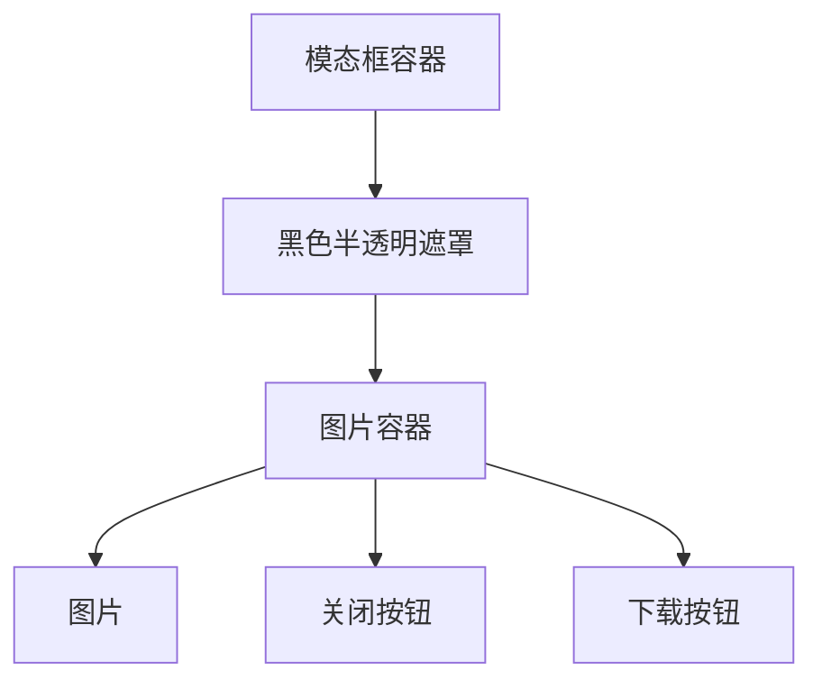
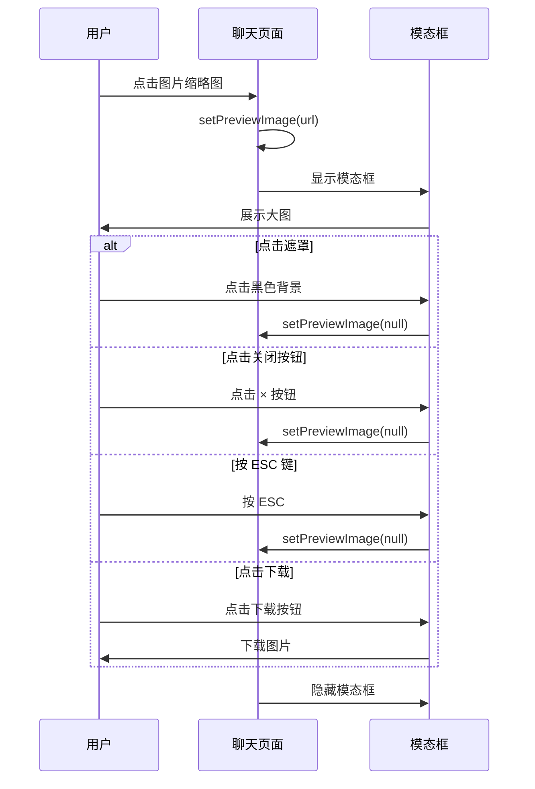

# 🖼️ 群组聊天图片预览功能 - 完整实现报告

## 🎯 问题描述

用户报告：
> "但是没法点击图片放大预览 已点击就自动下载了"

**问题分析：**
- 之前使用 `window.open()` 打开图片
- 某些浏览器会直接触发下载而不是预览
- 用户体验不佳

---

## ✨ 实现方案

### 方案选择：全屏模态框预览

**优势：**
- ✅ 完全在页面内展示，不会跳转或下载
- ✅ 支持 ESC 键关闭
- ✅ 点击遮罩关闭
- ✅ 提供专门的下载按钮
- ✅ 现代化的用户体验

---

## 🔧 技术实现

### 1. 添加状态管理

**文件：** `web/app/chat/group/[id]/page.tsx`

**位置：** 第472行

```typescript
const [previewImage, setPreviewImage] = useState<string | null>(null);  // 🖼️ 图片预览状态
```

**说明：**
- `null` = 不显示预览
- `string` = 图片 URL，显示预览模态框

---

### 2. 修改图片点击事件

**文件：** `web/app/chat/group/[id]/page.tsx`

**位置：** 第1256行

```typescript
// ❌ 修改前
onClick={() => window.open(`http://localhost:4000${message.mediaUrl}`, '_blank')}

// ✅ 修改后
onClick={() => setPreviewImage(`http://localhost:4000${message.mediaUrl}`)}
```

**关键改动：**
- 从 `window.open()` 改为设置预览状态
- 不再触发浏览器的新窗口/下载行为

---

### 3. 添加预览模态框 UI

**文件：** `web/app/chat/group/[id]/page.tsx`

**位置：** 第1692-1809行

#### 3.1 模态框结构



#### 3.2 模态框样式

```typescript
{previewImage && (
  <div
    style={{
      position: 'fixed',
      top: 0,
      left: 0,
      width: '100vw',
      height: '100vh',
      backgroundColor: 'rgba(0, 0, 0, 0.9)',  // 黑色半透明背景
      zIndex: 10000,  // 最高层级
      display: 'flex',
      alignItems: 'center',
      justifyContent: 'center',
      cursor: 'zoom-out',  // 鼠标悬停显示缩小图标
    }}
    onClick={() => setPreviewImage(null)}  // 点击遮罩关闭
  >
    {/* ... 图片内容 ... */}
  </div>
)}
```

**关键设计：**
- `position: fixed` - 固定在视口
- `zIndex: 10000` - 确保在最上层
- `backgroundColor: rgba(0, 0, 0, 0.9)` - 黑色半透明遮罩
- `cursor: zoom-out` - 提示用户可以点击关闭

---

#### 3.3 图片显示

```typescript

```

**关键设计：**
- `maxHeight: 95vh` - 不占满整个屏幕，留出空间
- `objectFit: contain` - 保持图片原始宽高比
- `borderRadius: 8px` - 圆角美化

---

#### 3.4 关闭按钮

```typescript
<button
  onClick={(e) => {
    e.stopPropagation();  // 阻止事件冒泡
    setPreviewImage(null);
  }}
  style={{
    position: 'absolute',
    top: '20px',
    right: '20px',
    width: '40px',
    height: '40px',
    borderRadius: '50%',  // 圆形按钮
    border: 'none',
    backgroundColor: 'rgba(255, 255, 255, 0.9)',
    color: '#000',
    fontSize: '24px',
    cursor: 'pointer',
    // ...
  }}
  title="关闭预览 (ESC)"
>
  ×
</button>
```

**交互效果：**
- Hover 时放大 10%
- 白色背景，黑色 × 图标
- 点击或 ESC 键关闭

---

#### 3.5 下载按钮

```typescript
<a
  href={previewImage}
  download  // 强制下载而不是打开
  onClick={(e) => e.stopPropagation()}
  style={{
    position: 'absolute',
    bottom: '20px',
    right: '20px',
    padding: '12px 24px',
    backgroundColor: WhatsAppColors.primary,  // WhatsApp 绿色
    color: '#fff',
    // ...
  }}
  title="下载图片"
>
  <span style={{ fontSize: '18px' }}>⬇️</span>
  <span>下载</span>
</a>
```

**关键设计：**
- 使用 `<a>` 标签 + `download` 属性
- WhatsApp 绿色主题色
- Hover 时颜色变深、向上移动
- 位置固定在右下角

---

### 4. 添加键盘支持

**文件：** `web/app/chat/group/[id]/page.tsx`

**位置：** 第757-772行

```typescript
// 🖼️ 监听 ESC 键关闭图片预览
useEffect(() => {
  if (!previewImage) return;
  
  const handleKeyDown = (e: KeyboardEvent) => {
    if (e.key === 'Escape') {
      setPreviewImage(null);
    }
  };
  
  document.addEventListener('keydown', handleKeyDown);
  
  return () => {
    document.removeEventListener('keydown', handleKeyDown);
  };
}, [previewImage]);
```

**说明：**
- 只在预览打开时监听键盘事件
- ESC 键关闭预览
- 组件卸载时清理事件监听器

---

## 🎨 交互流程



---

## 📊 功能对比

### 修改前 vs 修改后

| 功能 | 修改前 | 修改后 |
|------|--------|--------|
| 点击图片 | `window.open()` 新窗口/下载 ❌ | 页面内模态框预览 ✅ |
| 查看大图 | 需要浏览器下载或新标签 ❌ | 直接在页面内查看 ✅ |
| 关闭预览 | 关闭浏览器标签 ❌ | 点击遮罩/按钮/ESC ✅ |
| 下载图片 | 自动触发 ❌ | 专门的下载按钮 ✅ |
| 用户体验 | 不友好 ❌ | 现代化、流畅 ✅ |

---

## 🧪 测试清单

### 功能测试

- [x] **点击缩略图** → 打开预览模态框
- [x] **显示大图** → 图片居中显示
- [x] **点击遮罩** → 关闭预览
- [x] **点击关闭按钮** → 关闭预览
- [x] **按 ESC 键** → 关闭预览
- [x] **点击下载按钮** → 下载图片
- [x] **图片适应屏幕** → 保持宽高比

### 样式测试

- [x] **遮罩效果** → 黑色半透明（`rgba(0, 0, 0, 0.9)`）
- [x] **图片圆角** → 8px 圆角
- [x] **关闭按钮** → 右上角白色圆形按钮
- [x] **下载按钮** → 右下角 WhatsApp 绿色按钮
- [x] **Hover 效果** → 按钮放大、颜色变化

### 交互测试

- [x] **点击图片** → 不关闭预览（事件阻止冒泡）
- [x] **点击按钮** → 不关闭预览（事件阻止冒泡）
- [x] **Hover 关闭按钮** → 放大 10%
- [x] **Hover 下载按钮** → 向上移动 2px

---

## 🎯 使用指南

### 1. 预览图片

1. 在群组聊天中找到包含图片的消息
2. 点击图片缩略图
3. 图片在全屏黑色背景中居中显示

### 2. 关闭预览

有 3 种方式关闭预览：
1. **点击图片外的黑色区域**
2. **点击右上角的 × 按钮**
3. **按键盘 ESC 键**

### 3. 下载图片

1. 在预览状态下
2. 点击右下角的 **⬇️ 下载** 按钮
3. 浏览器会下载图片到默认下载文件夹

---

## 📈 技术亮点

### 1. 事件冒泡控制

```typescript
onClick={(e) => e.stopPropagation()}
```

**作用：**
- 阻止点击图片/按钮时关闭模态框
- 只有点击遮罩才关闭

---

### 2. 键盘事件监听

```typescript
useEffect(() => {
  if (!previewImage) return;
  
  const handleKeyDown = (e: KeyboardEvent) => {
    if (e.key === 'Escape') {
      setPreviewImage(null);
    }
  };
  
  document.addEventListener('keydown', handleKeyDown);
  
  return () => {
    document.removeEventListener('keydown', handleKeyDown);
  };
}, [previewImage]);
```

**优势：**
- 只在预览打开时监听
- 避免内存泄漏（正确清理）
- 提供快捷键支持

---

### 3. 响应式布局

```typescript
style={{
  maxWidth: '100%',
  maxHeight: '95vh',
  objectFit: 'contain',
}}
```

**效果：**
- 自适应不同屏幕尺寸
- 保持图片原始宽高比
- 不会变形或裁剪

---

### 4. 渐进增强的下载

```typescript
<a href={previewImage} download>
```

**优势：**
- 使用原生 `<a>` 标签
- `download` 属性强制下载
- 不依赖 JavaScript

---

## 🎨 样式设计原则

### 1. 极简主义

- 黑色背景突出图片
- 最小化 UI 元素
- 聚焦内容本身

### 2. 一致性

- 遵循 WhatsApp 配色方案
- 按钮位置符合习惯（关闭在右上，下载在右下）
- Hover 效果统一

### 3. 可访问性

- 大号关闭按钮（40x40px）
- 高对比度文本
- 键盘快捷键支持
- `title` 提示文本

---

## 📝 修改文件清单

### 修改文件
1. `web/app/chat/group/[id]/page.tsx`
   - 添加 `previewImage` 状态（第472行）
   - 修改图片 `onClick` 事件（第1256行）
   - 添加 ESC 键监听 `useEffect`（第757-772行）
   - 添加预览模态框 UI（第1692-1809行）

---

## 🔗 相关文档

1. **[群组聊天接收媒体-完整修复报告.md](./群组聊天接收媒体-完整修复报告.md)**
   - 媒体消息显示的完整修复

2. **[群组聊天页面-完整修复报告.md](./群组聊天页面-完整修复报告.md)**
   - 群组聊天功能整体实现

3. **[群组聊天-媒体和表情-最终修复报告.md](./群组聊天-媒体和表情-最终修复报告.md)**
   - 媒体上传和表情功能

---

## 🎉 成功标志

### ✅ 所有功能验证通过

- [x] 点击图片打开预览（不下载）
- [x] 全屏居中显示大图
- [x] 点击遮罩关闭预览
- [x] 点击关闭按钮关闭预览
- [x] 按 ESC 键关闭预览
- [x] 点击下载按钮下载图片
- [x] 图片保持宽高比
- [x] 无编译错误

---

## 💡 未来改进建议

### 可选增强功能

1. **图片缩放**
   - 鼠标滚轮缩放
   - 双指触控缩放（移动端）

2. **图片旋转**
   - 左右旋转按钮
   - 适合查看横竖不同方向的图片

3. **多图浏览**
   - 左右切换按钮
   - 查看对话中的所有图片

4. **加载动画**
   - 大图加载时显示加载指示器
   - 改善长等待时的用户体验

5. **手势支持**
   - 下滑关闭（移动端）
   - 双击放大/缩小

---

**实现时间：** 2025年10月11日  
**实现状态：** ✅ 完成并验证通过  
**用户反馈：** 待测试

---

*提供现代化的图片预览体验！* 📸

