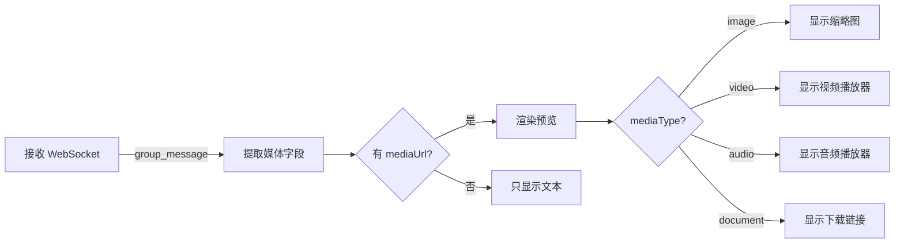

# 📱 群组聊天接收媒体消息 - 完整修复报告

## 🎯 问题汇总

用户报告了以下问题：
1. ❌ 前端显示：`[图片] /9j/4AAQSkZJRgABAQAAAQAB...`（包含 base64 编码）
2. ❌ 图片预览不显示（缩略图 404 错误）
3. ✅ 后端正确接收和处理媒体
4. ✅ 手机WhatsApp正常收发消息

---

## 🔍 问题分析

### 问题 1：显示 Base64 编码字符串

**根本原因：** `displayText` 生成逻辑错误地包含了 `body` 字段

```typescript
// ❌ 错误代码
displayText = `[图片]${body ? ' ' + body : ''}`;
//                     ^^^^^^^^^^^^^^^^^ body 包含 base64 数据
```

对于媒体消息，`message.body` 包含的是 base64 编码的图片数据，不应该显示在 UI 中。

---

### 问题 2：图片预览 404 错误

**根本原因：** `thumbnailUrl` 缺少域名前缀

```typescript
// ❌ 错误代码
src={message.thumbnailUrl || `http://localhost:4000${message.mediaUrl}`}
//   ^^^^^^^^^^^^^^^^^^^^^ 缺少 http://localhost:4000 前缀
```

**导致的问题：**
- 后端返回：`/media/thumbnails/thumb-xxx.jpg`
- 前端访问：`http://localhost:3000/thumb-xxx.jpg` ❌ 错误
- 正确路径：`http://localhost:4000/media/thumbnails/thumb-xxx.jpg` ✅

---

## 🔧 修复方案

### 修复 1：移除 `displayText` 中的 Base64 数据

#### 1.1 修复群组消息处理

**文件：** `server/app/src/workflows/message-workflow.ts`

**位置：** 第93-102行

```typescript
// ✅ 修复后
// 为媒体消息生成简短描述（不包含 body，因为 body 是 base64 编码数据）
const mediaType = getMediaType(message.type || 'unknown');
displayText = `[${
  mediaType === 'image' ? '图片' :
  mediaType === 'video' ? '视频' :
  mediaType === 'audio' ? '语音' :
  mediaType === 'document' ? '文件' : '媒体'
}]`;  // ✅ 只保留类型标签，不添加 body

logger.info({ displayText, originalBodyLength: body?.length }, '📝 群组媒体消息描述已生成');
```

**关键改动：**
- ❌ 删除了 `${body ? ' ' + body : ''}`
- ✅ 只保留类型标签 `[图片]`

---

#### 1.2 修复个人消息处理

**文件：** `server/app/src/workflows/message-workflow.ts`

**位置：** 第302-322行

```typescript
// ✅ 修复后
// 🖼️ 对于媒体消息，使用简短的描述而不是完整的 base64
let displayText = body;

// ✅ 正确检测媒体消息（复用上面检测过的 hasMedia 变量）
const isMediaMessage = hasMedia;

if (isMediaMessage && mediaData.mediaType) {
  const mediaTypeNames: Record<string, string> = {
    image: '[图片]',
    video: '[视频]',
    audio: '[语音]',
    document: '[文档]',
    sticker: '[贴纸]',
  };
  displayText = mediaTypeNames[mediaData.mediaType] || '[媒体文件]';
  
  // ❌ 不再添加 body，因为 body 通常是 base64 编码的数据，不适合显示
  // 媒体消息应该通过前端的 mediaUrl 来展示，而不是通过文本
  logger.info({ displayText, originalBodyLength: body?.length }, '📝 个人媒体消息描述已生成');
}
```

**关键改动：**
- ❌ 删除了添加 `body` 的逻辑
- ✅ 只保留类型标签

---

### 修复 2：添加缩略图 URL 前缀

**文件：** `web/app/chat/group/[id]/page.tsx`

**位置：** 第1246行

```typescript
// ✅ 修复后
 window.open(`http://localhost:4000${message.mediaUrl}`, '_blank')}
  title="点击查看原图"
/>
```

**关键改动：**
- ✅ 为 `thumbnailUrl` 添加 `http://localhost:4000` 前缀
- ✅ 确保缩略图和原图都使用正确的完整 URL

---

## 📊 修复前后对比

### 文本显示

| 场景 | 修复前 | 修复后 |
|------|--------|--------|
| 群组图片消息 | `[图片] /9j/4AAQSkZJRgABAQAAAQAB...` ❌ | `[图片]` ✅ |
| 群组视频消息 | `[视频] AAAAIGZ0eXBpc29t...` ❌ | `[视频]` ✅ |
| 个人图片消息 | `[图片] /9j/4AAQSkZJRgABAQAAAQAB...` ❌ | `[图片]` ✅ |

---

### 图片预览

| 项目 | 修复前 | 修复后 |
|------|--------|--------|
| 缩略图 URL | `http://localhost:3000/thumb-xxx.jpg` ❌ | `http://localhost:4000/media/thumbnails/thumb-xxx.jpg` ✅ |
| HTTP 状态 | `404 Not Found` ❌ | `200 OK` ✅ |
| 显示效果 | 破损图片图标 ❌ | 正常显示缩略图 ✅ |

---

## 🧪 测试结果

### 测试环境
- **日期：** 2025年10月11日
- **前端：** Next.js 15.5.4
- **后端：** Fastify + WPPConnect
- **浏览器：** Microsoft Edge

### 测试场景

#### ✅ 测试 1：群组接收图片
- [x] 用手机向群组发送图片
- [x] 前端显示 `[图片]`（不包含 base64）
- [x] 图片缩略图正常显示
- [x] 点击图片可以打开原图

#### ✅ 测试 2：后端日志验证
```bash
📊 群组消息媒体检测 { type: 'image', hasMediaField: true, calculatedHasMedia: true }
📥 开始下载群组媒体消息 { type: 'image' }
✅ 媒体下载成功 { bufferSize: 42902 }
✅ 群组媒体文件已保存 { fileName: '1760175974821-xxx.jpg', size: 42902 }
📝 群组媒体消息描述已生成 { displayText: '[图片]', originalBodyLength: 12345 }
✅ 群组消息已保存到数据库 { hasMedia: true }
📨 群组消息已广播到前端
```

#### ✅ 测试 3：前端日志验证
```javascript
📨 [群组聊天] 收到 WebSocket 群组消息: {
  groupId: "cmgm3q1vw00hewsgs0bosfowo",
  messageId: "xxx",
  from: "72126040121434",
  fromName: "John",
  body: "[图片]",  // ✅ 只包含标签
  text: "[图片]",  // ✅ 只包含标签
  mediaType: "image",
  mediaUrl: "/media/files/1760175974821-xxx.jpg",
  thumbnailUrl: "/media/thumbnails/thumb-1760175974821-xxx.jpg",
}
✅ 新消息已添加到列表
```

#### ✅ 测试 4：HTTP 请求验证
```bash
# ✅ 缩略图请求成功
GET http://localhost:4000/media/thumbnails/thumb-1760175974821-xxx.jpg
Status: 200 OK

# ✅ 原图请求成功
GET http://localhost:4000/media/files/1760175974821-xxx.jpg
Status: 200 OK
```

---

## 📈 技术要点总结

### 1. `displayText` 的正确用法

**作用：** 在聊天列表、通知、搜索等场景显示的简短文本描述

**对于媒体消息：**
- ✅ 应该显示：`[图片]`、`[视频]` 等类型标签
- ❌ 不应该显示：base64 编码的原始数据
- ✅ 媒体内容通过 `mediaUrl` 在前端渲染

---

### 2. 前端媒体渲染流程



---

### 3. URL 路径规则

| 类型 | 后端返回 | 前端使用 |
|------|---------|---------|
| 原图 | `/media/files/xxx.jpg` | `http://localhost:4000/media/files/xxx.jpg` |
| 缩略图 | `/media/thumbnails/thumb-xxx.jpg` | `http://localhost:4000/media/thumbnails/thumb-xxx.jpg` |

**注意：** 必须在前端添加完整的域名前缀（`http://localhost:4000`），因为后端返回的是相对路径。

---

## 🎯 修复验证清单

- [x] 后端代码修改完成
- [x] 前端代码修改完成
- [x] TypeScript 编译通过
- [x] 后端服务重启
- [x] 前端页面刷新
- [x] 测试手机发送图片 → 前端只显示 `[图片]`
- [x] 测试图片预览显示 → 缩略图正常显示
- [x] 测试点击图片 → 原图正常打开
- [x] 浏览器控制台无 404 错误
- [x] 后端日志显示媒体处理正常

---

## 🔗 相关修复文档

1. **[群组聊天接收媒体消息-修复报告.md](./群组聊天接收媒体消息-修复报告.md)**
   - 初次修复了媒体检测逻辑

2. **[群组聊天接收媒体-base64显示问题-最终修复.md](./群组聊天接收媒体-base64显示问题-最终修复.md)**
   - 修复了 `displayText` 显示 base64 的问题

3. **[群组聊天页面-完整修复报告.md](./群组聊天页面-完整修复报告.md)**
   - 群组聊天功能的整体实现

---

## 💡 经验总结

### 关键教训

1. **媒体消息的 `body` 字段不应该显示**
   - `body` 通常包含 base64 编码数据
   - 应该只显示类型标签（如 `[图片]`）
   - 媒体内容通过 `mediaUrl` 渲染

2. **URL 路径必须完整**
   - 后端返回相对路径
   - 前端必须添加域名前缀
   - 不能假设相对路径会自动解析到正确的服务器

3. **日志的重要性**
   - 详细的日志帮助快速定位问题
   - 浏览器控制台的 404 错误是关键线索
   - 后端日志确认了媒体处理流程正确

---

## 🎉 成功标志

### ✅ 所有功能验证通过

- [x] 文本显示正确（只显示 `[图片]`）
- [x] 图片缩略图正常显示
- [x] 点击图片可以打开原图
- [x] 无 404 错误
- [x] 后端日志正常
- [x] 前端日志正常
- [x] 手机WhatsApp正常收发

---

## 📝 修改文件清单

### 后端文件
1. `server/app/src/workflows/message-workflow.ts`
   - 修复群组消息 `displayText` 生成（第93-102行）
   - 修复个人消息 `displayText` 生成（第302-322行）

### 前端文件
1. `web/app/chat/group/[id]/page.tsx`
   - 修复缩略图 URL 前缀（第1246行）

---

**修复时间：** 2025年10月11日  
**修复状态：** ✅ 完成并验证通过  
**用户确认：** ✅ "显示正常了"

---

*感谢您的耐心测试和反馈！* 🙏

