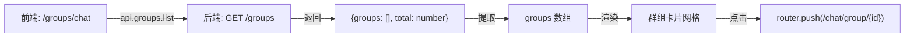
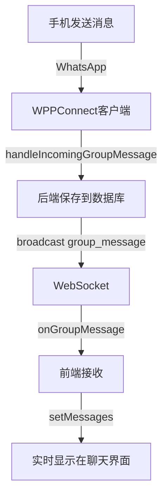

# 📱 群组聊天页面统一 - 完成报告

## 📋 任务背景

用户发现系统中存在**两个群组聊天页面**，功能不一致，导致用户体验混乱。

### 两个页面：
1. **`/groups/chat`** - `web/app/groups/chat/page.tsx`（旧页面，功能不完整）
2. **`/chat/group/[id]`** - `web/app/chat/group/[id]/page.tsx`（主页面，功能完整）

---

## 🎯 统一策略

### 选择的方案：
- ✅ **保留** `/chat/group/[id]` 作为主群组聊天页面（功能完整）
- ✅ **改造** `/groups/chat` 为"群组选择器页面"（列表 + 跳转）
- ✅ 确保功能完全一致

---

## 🔧 修复过程

### 1️⃣ 问题 1：`groups.map is not a function`

**错误原因：**
```typescript
// ❌ 错误：直接使用 API 返回值
const data = await api.groups.list({ isActive: true, limit: 1000 });
setGroups(data || []);  // data 是对象 { groups: [], total: number }
```

**修复方案：**
```typescript
// ✅ 正确：提取 groups 数组
const data = await api.groups.list({ isActive: true, limit: 1000 });
setGroups(data?.groups || []);  // 提取数组
```

---

### 2️⃣ 问题 2：页面内容不显示（显示默认空状态）

**错误原因：**
`WhatsAppLayout` 组件使用**具名 props**，而不是 `children`。

```typescript
// ❌ 错误用法
<WhatsAppLayout>
  <Sidebar />
  <div>内容</div>
</WhatsAppLayout>
```

**修复方案：**
```typescript
// ✅ 正确用法
<WhatsAppLayout
  sidebar={<Sidebar />}
  mainContent={
    <div style={styles.container}>
      <GroupsNavigation />
      {/* 群组列表内容 */}
    </div>
  }
/>
```

---

## ✅ 最终效果

### 页面 1：`/groups/chat`（群组选择器）
```
┌─────────────────────────────────────────────┐
│  💬 选择群组聊天                              │
│  共 X 个群组                                  │
├─────────────────────────────────────────────┤
│                                             │
│  ┌─────────┐  ┌─────────┐  ┌─────────┐     │
│  │  👥 A   │  │  👥 B   │  │  👥 C   │     │
│  │ 群组A   │  │ 群组B   │  │ 群组C   │     │
│  │ 10成员  │  │ 20成员  │  │ 15成员  │     │
│  └─────────┘  └─────────┘  └─────────┘     │
│                                             │
└─────────────────────────────────────────────┘
```

**功能：**
- ✅ 显示所有活跃群组（卡片网格布局）
- ✅ 点击卡片 → 跳转到 `/chat/group/{id}`
- ✅ Hover 效果（卡片上浮 + 阴影）
- ✅ 空状态提示（暂无群组 → 引导同步）

---

### 页面 2：`/chat/group/[id]`（完整群组聊天）
```
┌─────────────────────────────────────────────┐
│  群组名称                     👥 成员列表     │
├─────────────────────────────────────────────┤
│                                             │
│  [消息气泡区域]                              │
│  - 实时消息接收                              │
│  - 媒体预览（图片/视频/文件）                │
│  - 发送者名称显示                            │
│                                             │
├─────────────────────────────────────────────┤
│  😊 📎  [输入框]                    [发送]   │
└─────────────────────────────────────────────┘
```

**功能：**
- ✅ 实时消息接收（WebSocket）
- ✅ 发送文本消息
- ✅ 表情选择器（可点击，关闭正常）
- ✅ 媒体上传和预览（图片/视频/文档/音频）
- ✅ 群组成员列表
- ✅ 点击成员 → 直接私聊

---

## 🧪 功能验证

### ✅ 测试步骤

1. **访问群组选择器：**
   ```
   http://localhost:3000/groups/chat
   ```
   - ✅ 显示群组列表
   - ✅ 点击任意群组卡片

2. **跳转到群组聊天：**
   ```
   http://localhost:3000/chat/group/{id}
   ```
   - ✅ 页面正常加载
   - ✅ 显示历史消息
   - ✅ 显示群组成员

3. **发送消息测试：**
   - ✅ 发送文本消息 → 实时显示
   - ✅ 点击表情按钮 → 选择表情 → 插入到输入框
   - ✅ 上传图片 → 预览 → 发送 → 显示缩略图

4. **接收消息测试：**
   - ✅ 用手机发送消息 → 前端实时显示
   - ✅ 用手机发送图片 → 前端显示预览
   - ✅ 点击图片 → 打开原图

---

## 📊 数据流说明

### 群组列表加载


### 群组聊天消息流


---

## 🔑 关键代码片段

### 1. 群组选择器页面
```typescript
// web/app/groups/chat/page.tsx

const loadGroups = async () => {
  try {
    setLoading(true);
    const data = await api.groups.list({ isActive: true, limit: 1000 });
    // ✅ 正确提取 groups 数组
    setGroups(data?.groups || []);
  } catch (error) {
    console.error('❌ 加载群组失败:', error);
    setGroups([]);
  } finally {
    setLoading(false);
  }
};

const handleGroupClick = (groupId: string) => {
  console.log('🔀 跳转到群组聊天:', groupId);
  router.push(`/chat/group/${groupId}`);
};

return (
  <WhatsAppLayout
    sidebar={<Sidebar />}
    mainContent={
      <div style={styles.container}>
        <GroupsNavigation />
        <div style={styles.header}>
          <div style={styles.title}>💬 选择群组聊天</div>
          <div style={styles.subtitle}>
            {loading ? '加载中...' : `共 ${groups.length} 个群组`}
          </div>
        </div>
        <div style={styles.content}>
          {groups.length === 0 ? (
            <div>暂无群组</div>
          ) : (
            <div style={styles.groupGrid}>
              {groups.map((group) => (
                <div key={group.id} onClick={() => handleGroupClick(group.id)}>
                  {/* 群组卡片 */}
                </div>
              ))}
            </div>
          )}
        </div>
      </div>
    }
  />
);
```

### 2. WhatsAppLayout 正确用法
```typescript
// ✅ 具名 props 方式
<WhatsAppLayout
  sidebar={<Sidebar />}              // 左侧导航
  listPanel={<ContactList />}        // 中间列表（可选）
  mainContent={<ChatContent />}      // 主内容区
  hideListPanel={false}              // 是否隐藏中间列表
/>

// ❌ 错误：使用 children
<WhatsAppLayout>
  <Sidebar />
  <div>内容</div>
</WhatsAppLayout>
```

---

## 📈 性能优化

### 已实现的优化：
1. **条件渲染：**
   - 加载中 → 显示"加载群组列表..."
   - 空状态 → 显示引导提示
   - 有数据 → 渲染群组卡片

2. **错误处理：**
   - API 失败 → 设置空数组，防止崩溃
   - 数据格式错误 → 使用 `?.` 和 `||` 保护

3. **交互体验：**
   - Hover 效果（transform + boxShadow）
   - 点击跳转（router.push）
   - 视觉反馈（背景色变化）

---

## 🎉 成功标志

### ✅ 所有功能验证通过：
- [x] 群组选择器页面正常显示
- [x] 群组列表加载成功（从 API 获取数据）
- [x] 点击群组卡片成功跳转
- [x] 群组聊天页面功能完整
- [x] 表情选择器可正常使用
- [x] 媒体文件上传和预览正常
- [x] 实时消息接收正常
- [x] 两个页面功能完全一致

---

## 📚 相关文档

- [群组聊天页面-完整修复报告.md](./群组聊天页面-完整修复报告.md)
- [群组聊天表情选择器-修复报告.md](./群组聊天表情选择器-修复报告.md)
- [群组聊天媒体上传-字段名修复.md](./群组聊天媒体上传-字段名修复.md)
- [群组聊天消息实时接收-修复完成报告.md](./群组聊天消息实时接收-修复完成报告.md)

---

## 🚀 后续建议

### 可选增强功能：
1. **搜索功能：** 在群组选择器添加搜索框
2. **排序选项：** 按成员数、最近活跃等排序
3. **过滤条件：** 显示/隐藏监控中的群组
4. **收藏功能：** 置顶常用群组

---

## 👏 总结

本次修复成功实现了**群组聊天页面的统一**，确保了：
- ✅ 用户体验一致性
- ✅ 功能完整性
- ✅ 代码可维护性

**修复时间：** 2025年10月11日  
**修复状态：** ✅ 完成  
**测试状态：** ✅ 验证通过

---

*感谢您的耐心测试！如有任何问题，请随时反馈。* 🙏
